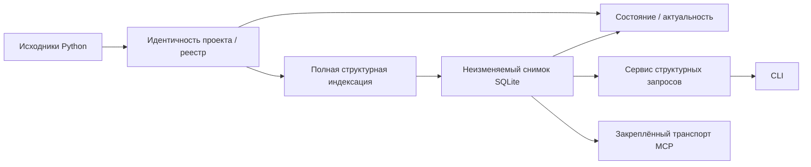

# Project KB

> **Состояние: замороженная реализация для портфолио и справочный пример (frozen portfolio/reference implementation).**

Project KB — локальная база структурного знания о Python-проекте, ориентированная на чтение. Она
строит неизменяемый снимок SQLite, отделённый от исходников, и предоставляет
узкое структурное чтение через CLI/поверхность запросов и постоянный транспорт MCP.

Основные ориентиры дизайна:

- проверяемая актуальность вместо молчаливого доверия устаревшему снимку;
- воспроизводимый полный захват и явное происхождение;
- ограниченная ответственность за запись вне дерева исходников;
- отказ по умолчанию на границах идентичности, путей и возможностей;
- детерминированные идентификаторы там, где их гарантирует контракт.

## Что это

Project KB превращает допустимую совокупность Git локального проекта в структурный
снимок: сведения о файлах, символах/импортах Python, связях и диагностике. Исходники,
индексация и снимок остаются разными слоями; целевой код Python не импортируется и не
исполняется.

Канонический сервис запросов читает активный снимок через проверки механизма разрешения. Отдельный
долгоживущий процесс `pkb-mcp` обслуживает ограниченные структурные запросы к одному явно
закреплённому снимку без права менять состояние исходников, искать `latest` или усиливать
утверждение об актуальности.

## Зачем это нужно

Повторное сканирование большой или долгоживущей кодовой базы может увеличивать задержку,
шум и расход контекста агентных инструментов. Project KB исследует более узкий подход: один
структурный источник полезен, когда идентичность проекта явна, снимок заморожен, запросы
ограничены, а устаревшее состояние обнаруживается, а не принимается на доверии.

Это архитектурный выбор, а не обещание, что Project KB всегда быстрее, дешевле или
точнее прямого чтения исходников.

## Что реализовано

| Возможность | Состояние | Граница |
| --- | --- | --- |
| Реестр проектов и идентичность | Реализовано | `register`, `projects`, `relink`, `unregister`; активная привязка рабочей копии проверяется явно |
| Полная структурная индексация | Реализовано | Полная сборка, проверка/закрытие и атомарная публикация канонического снимка SQLite |
| Состояние и актуальность | Реализовано | Доступность отделена от строгой проверки; удалённый `fast` не создаёт утверждение о текущести |
| Неизменяемое средство чтения снимка и запросы CLI | Реализовано | `symbols`, `imports`, `inspect`; структурный поиск только для чтения после проверки разрешения |
| Постоянный структурный транспорт MCP | Реализовано | Четыре ограниченных инструмента только для чтения одного закреплённого оператором снимка |
| Жизненный цикл управляемых поколений | Только внутренний | Однократно создаваемые поколения, селекторы, чтение точного поколения и сравнения без публичной точки входа CLI/MCP |
| Поиск, экспорт, пакеты контекста | Отключено | Обобщённый/семантический поиск и генерация экспорта/контекста не входят в замороженный контракт возможностей |

CLI также предоставляет `version`, `status` и `capabilities`. Публичного стабильного
Python API проект не объявляет.

## Быстрый старт

Требуется Python `>=3.14`. Из корня рабочей копии установите зафиксированные зависимости и
проверьте CLI:

```text
uv sync
uv run pkb --help
```

Минимальный путь для локального Git-проекта:

```text
uv run pkb register my-project .
uv run pkb index my-project --full
uv run pkb status my-project --verify strong
uv run pkb symbols my-project --name MySymbol
```

`register` и `index` пишут только в управляемое хранилище Project KB, не в дерево исходников.
Имя проекта можно опустить в `status`, `index` и структурных запросах, если текущий
каталог находится внутри зарегистрированного репозитория. `index` и `index --full`
сейчас выполняют одну и ту же полную сборку; инкрементальная индексация не реализована.

Для MCP оператор должен передать процессу `PKB_MCP_SNAPSHOT_PATH`,
`PKB_MCP_PROJECT_ID`, `PKB_MCP_SNAPSHOT_ID`, `PKB_MCP_SNAPSHOT_SHA256` и
`PKB_MCP_SOURCE_COMMIT`, затем запустить:

```text
uv run pkb-mcp
```

Транспорт использует `stdio` и не разрешает реестр, активный снимок или актуальность
автоматически: полная закреплённая идентичность является обязательной частью запуска.

## Архитектура в общих чертах



- Дерево исходников — вход только для чтения, а не изменяемое хранилище знаний.
- Полная сборка создаёт закрытый снимок до его атомарной публикации.
- Доступность и актуальность — независимые оси; `CURRENT` относится к моменту проверки.
- CLI читает канонический снимок через проверки механизма разрешения.
- MCP — отдельный закреплённый транспорт, а не источник истины или текущий интерфейс реестра.

Подробности ответственности и потоков данных: [архитектура](docs/ARCHITECTURE.md).

## Эксперименты и выводы

| Область | Наблюдение | Ограничение |
| --- | --- | --- |
| E4A до MCP | Проверенные рабочие процессы доступа были жизнеспособны | Каждая точная ячейка имела `N=1`; широкое обобщение не поддерживается |
| G2 — `AUDIT_1V2` | Сравниваемые политики дали сильный описательный сигнал эффективности по времени и входным токенам | Фактическое использование MCP не было обязательным, поэтому причинный эффект Project KB/MCP не изолирован |
| G2 — `AUDIT_4V2` | Преимущество по времени было небольшим или отсутствовало, а обе сравниваемые политики потребовали примерно в 2,4 раза больше входных токенов | Отрицательный результат нельзя скрывать общим средним или превращать в универсальный вывод |
| Расширение и заморозка | Расширение остановлено до формальной N5; G3 не создавался | Заморозка — инженерное/продуктовое решение, а не научный результат |

Исправление оценщика ослабило наивное сравнение канонической корректности: поздняя диагностика
только по отображению идентификаторов не заменяет историческое оценивание. Результаты описывают конкретные задачи,
условия и среду; они не устанавливают статистическую значимость, общее превосходство или
чистый причинный эффект.

Методика и полная интерпретация находятся в [методологии экспериментального стенда](docs/BENCHMARK.md)
и [экспериментах и результатах](docs/EXPERIMENTS_AND_RESULTS.md).

## Безопасность и ограничения

- Репозиторий исходников не является изменяемым хранилищем знаний; постоянные записи ограничены
  явно принадлежащим Project KB управляемым хранилищем.
- Снимок и управляемые поколения имеют раздельных владельцев и контуры публикации.
- Команда `status` проверяет устаревание и актуальность; читаемый снимок не обязательно актуален.
- Неподдерживаемые возможности остаются выключенными и не выводятся из наличия хранилища или
  внутренней подсистемы.
- MCP предоставляет только структурный, ориентированный на чтение доступ к закреплённому снимку и не
  доказывает его текущесть.
- Проект не проходил промышленную сертификацию; выводы экспериментов зависят от задач и
  среды измерения.
- Замороженное состояние не обещает активной дальнейшей разработки.

Нормативные границы записи, Git, путей, секретов и отказа по умолчанию описаны в
[политике безопасности данных](docs/DATA_SAFETY_POLICY.md).

## Документация

| Документ | Назначение |
| --- | --- |
| [Архитектура](docs/ARCHITECTURE.md) | Текущая архитектура, компоненты и границы ответственности |
| [Политика безопасности данных](docs/DATA_SAFETY_POLICY.md) | Границы записи, чтения, идентичности и актуальности |
| [Контрольный список разработки](docs/DEVELOPMENT_CHECKLIST.md) | Стабильные контрольные пункты для участников разработки и публикации |
| [История разработки](docs/DEVELOPMENT_HISTORY.md) | Инженерная история и решение о заморозке |
| [Методология экспериментального стенда](docs/BENCHMARK.md) | Дизайн экспериментов и границы интерпретации |
| [Эксперименты и результаты](docs/EXPERIMENTS_AND_RESULTS.md) | Измеренные результаты, исправления и интерпретация заморозки |

## Состояние проекта

**Состояние: заморожен.** Кодовая база сохранена как законченная реализация для портфолио и справочный пример,
демонстрирующая архитектуру структурных снимков, границы безопасности и ограниченную
экспериментальную проверку.

Дальнейшее расширение стенда, G3, реконструкция формальной N5 и ремонт оценщика не
являются активными направлениями работы. Это осознанное завершение границ, а не утверждение о
сломанном или незавершённом состоянии проекта.
