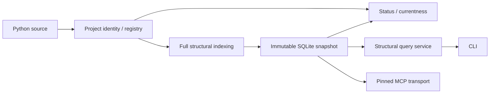

# Project KB

> **Status: frozen portfolio/reference implementation.**

Project KB — локальная read-oriented база структурного знания о Python-проекте. Она
строит неизменяемый SQLite snapshot, отделённый от исходников, и предоставляет
узкие структурные чтения через CLI/query surface и persistent MCP transport.

Основные ориентиры дизайна:

- проверяемая currentness вместо молчаливого доверия устаревшему snapshot;
- воспроизводимый полный capture и явная provenance;
- ограниченное владение записью вне source tree;
- fail-closed поведение на границах identity, paths и capabilities;
- детерминированные идентификаторы там, где их гарантирует контракт.

## What it is

Project KB превращает допустимую Git population локального проекта в структурный
snapshot: сведения о файлах, Python symbols/imports, relations и diagnostics. Source,
indexing и snapshot остаются разными слоями; целевой Python-код не импортируется и не
исполняется.

Канонический query service читает активный snapshot через resolver gates. Отдельный
долгоживущий `pkb-mcp` process обслуживает bounded structural queries к одному явно
закреплённому snapshot без права менять source state, искать `latest` или повышать
currentness claim.

## Why it exists

Повторное сканирование большого или долго живущего codebase может увеличивать latency,
шум и расход контекста agentic tools. Project KB исследует более узкий подход: один
структурный источник полезен, когда identity проекта явна, snapshot заморожен, запросы
ограничены, а stale state обнаруживается, а не принимается на доверии.

Это архитектурный выбор, а не обещание, что Project KB всегда быстрее, дешевле или
точнее прямого чтения исходников.

## What is implemented

| Capability | Status | Boundary |
| --- | --- | --- |
| Project registry и identity | Implemented | `register`, `projects`, `relink`, `unregister`; active workspace binding проверяется явно |
| Full structural indexing | Implemented | Полная сборка, validation/sealing и атомарная публикация canonical SQLite snapshot |
| Status и currentness | Implemented | Availability отделена от strong verification; удалённый `fast` не создаёт claim о текущести |
| Immutable snapshot reader и CLI queries | Implemented | `symbols`, `imports`, `inspect`; resolver-gated read-only structural lookup |
| Persistent structural MCP transport | Implemented | Четыре bounded read-only tools над одним operator-pinned snapshot |
| Managed generation lifecycle | Internal-only | Create-once generations, selectors, exact reads и comparisons без публичного CLI/MCP entrypoint |
| Search, exports, context packs | Disabled | Generic/semantic search и генерация exports/context не входят в frozen capability contract |

CLI также предоставляет `version`, `status` и `capabilities`. Публичного стабильного
Python API проект не объявляет.

## Quick start

Требуется Python `>=3.14`. Из корня checkout установите зафиксированные зависимости и
проверьте CLI:

```text
uv sync
uv run pkb --help
```

Минимальный путь для локального Git-проекта:

```text
uv run pkb register my-project .
uv run pkb index my-project --full
uv run pkb status my-project --verify strong
uv run pkb symbols my-project --name MySymbol
```

`register` и `index` пишут только в managed storage Project KB, не в source tree.
Имя проекта можно опустить в `status`, `index` и структурных запросах, если текущий
каталог находится внутри зарегистрированного repository. `index` и `index --full`
сейчас выполняют одну и ту же полную сборку; incremental indexing не реализован.

Для MCP operator должен передать процессу `PKB_MCP_SNAPSHOT_PATH`,
`PKB_MCP_PROJECT_ID`, `PKB_MCP_SNAPSHOT_ID`, `PKB_MCP_SNAPSHOT_SHA256` и
`PKB_MCP_SOURCE_COMMIT`, затем запустить:

```text
uv run pkb-mcp
```

Transport использует stdio и не разрешает registry, active snapshot или currentness
автоматически: полная pinned identity является обязательной частью запуска.

## Architecture at a glance



- Source tree — read-only вход, а не writable knowledge store.
- Полная сборка создаёт sealed snapshot до его атомарной публикации.
- Availability и currentness — независимые оси; `CURRENT` относится к моменту проверки.
- CLI читает canonical snapshot через resolver gates.
- MCP — отдельный pinned transport, а не source of truth или live registry frontend.

Подробности ownership и data flows: [Architecture](docs/ARCHITECTURE.md).

## Experiments and findings

| Area | Observation | Limit |
| --- | --- | --- |
| E4A pre-MCP | Проверенные access workflows были жизнеспособны | Каждая exact cell имела `N=1`; широкое обобщение не поддерживается |
| G2 — `AUDIT_1V2` | Candidate policies дали сильный описательный сигнал эффективности по elapsed и input tokens | Фактическое MCP-использование не было обязательным, поэтому причинный эффект Project KB/MCP не изолирован |
| G2 — `AUDIT_4V2` | Elapsed benefit был мал или отсутствовал, а обе candidate policies потребовали примерно в 2,4 раза больше input tokens | Отрицательный результат нельзя скрывать общим средним или превращать в универсальный вывод |
| Expansion и freeze | Расширение остановлено до formal N5; G3 не создавался | Freeze — инженерное/product decision, а не научный результат |

Evaluator erratum ослабил наивное сравнение canonical correctness: поздняя mapping-only
диагностика не заменяет историческую evaluation. Результаты описывают конкретные задачи,
условия и среду; они не устанавливают статистическую значимость, общее превосходство или
чистый causal effect.

Методика и полная интерпретация находятся в [Benchmark Methodology](docs/BENCHMARK.md)
и [Experiments and Results](docs/EXPERIMENTS_AND_RESULTS.md).

## Safety and limitations

- Source repository не является writable knowledge store; persistent writes ограничены
  явно принадлежащим Project KB managed storage.
- Snapshot и managed generations имеют раздельных владельцев и publication lanes.
- Status проверяет stale/currentness state; читаемый snapshot не обязательно current.
- Unsupported capabilities остаются выключенными и не выводятся из наличия storage или
  внутреннего subsystem.
- MCP предоставляет только structural/read-oriented доступ к pinned snapshot и не
  доказывает его текущесть.
- Проект не проходил промышленную сертификацию; benchmark findings зависят от задач и
  среды измерения.
- Frozen status не обещает активной дальнейшей разработки.

Нормативные границы записи, Git, paths, secrets и fail-closed поведения описаны в
[Data Safety Policy](docs/DATA_SAFETY_POLICY.md).

## Documentation

| Document | Purpose |
| --- | --- |
| [Architecture](docs/ARCHITECTURE.md) | Текущая архитектура, компоненты и ownership boundaries |
| [Data Safety Policy](docs/DATA_SAFETY_POLICY.md) | Границы записи, чтения, identity и currentness |
| [Development Checklist](docs/DEVELOPMENT_CHECKLIST.md) | Стабильные contributor и publication gates |
| [Development History](docs/DEVELOPMENT_HISTORY.md) | Инженерная история и решение о freeze |
| [Benchmark Methodology](docs/BENCHMARK.md) | Дизайн экспериментов и границы интерпретации |
| [Experiments and Results](docs/EXPERIMENTS_AND_RESULTS.md) | Измеренные результаты, errata и freeze interpretation |

## Project status

**Status: frozen.** Codebase сохранён как законченная portfolio/reference implementation,
демонстрирующая structural snapshot architecture, safety boundaries и ограниченную
экспериментальную проверку.

Дальнейшее benchmark expansion, G3, реконструкция formal N5 и ремонт evaluator не
являются активными workstreams. Это осознанное завершение scope, а не утверждение о
сломанном или незавершённом состоянии проекта.
