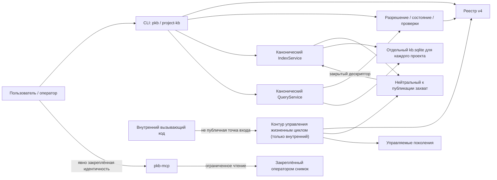
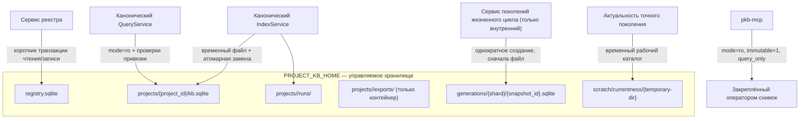
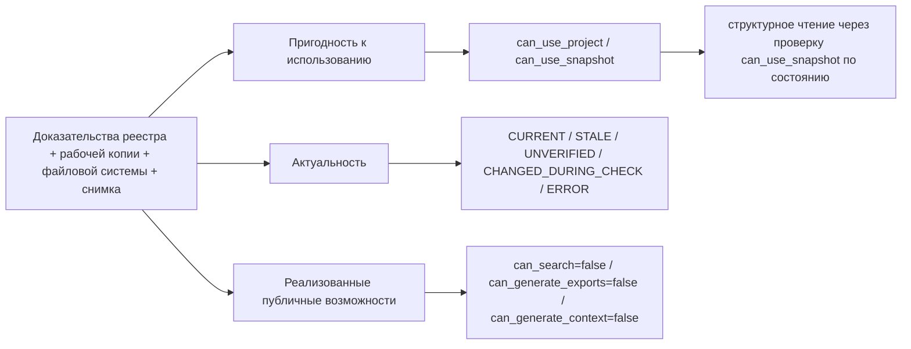

# Архитектура Project KB

Project KB — замороженная реализация для портфолио и справочный пример (portfolio/reference implementation). Этот документ — единственный технический владелец её текущей архитектуры и описывает реализованные границы системы и вспомогательные внутренние механизмы в их текущем виде, а не предполагаемое развитие системы.

## 1. Границы и правила выбора источника истины

Project KB — локальная справочная реализация для построения и чтения структурных снимков Git-проектов. Текущий публичный контракт намеренно узок: регистрация проектов, полная каноническая индексация, получение состояния и актуальности, структурные операции поиска и чтение явно закреплённого снимка через MCP.

Для технических утверждений действует следующий порядок источников:

1. исполняемый код и упаковка;
2. тесты, фиксирующие наблюдаемый контракт и поведение с отказом по умолчанию;
3. этот документ как консолидированное описание текущего состояния.

Нормативные требования к записи, путям, Git, секретам и отказам принадлежат [политике безопасности данных](DATA_SAFETY_POLICY.md). Здесь они рассматриваются только в той мере, в какой определяют архитектурные границы.

Нужно различать две независимые версии форматов:

- схема реестра имеет версию **4**;
- семантическая схема снимка SQLite имеет версию **2**.

Числа не являются версиями одного и того же формата. Реестр хранит идентичность контура управления и состояние жизненного цикла; снимок хранит захваченные структурные данные.

## 2. Контекст системы и карта компонентов

Текстовый эквивалент: публичный CLI работает с текущим реестром, механизмом разрешения, каноническим публикатором и каноническим `QueryService`. Внутренний контур управления жизненным циклом использует общий стык захвата, но публикует только управляемые поколения. Отдельный процесс `pkb-mcp` читает только переданный оператором и криптографически закреплённый снимок; он не обращается к текущему реестру, механизму разрешения, проверке актуальности или жизненному циклу. Публичной связи CLI/MCP с API жизненного цикла нет.

## 3. Компоненты и границы ответственности

| Компонент | Ответственность | Публичная поверхность | Хранилище/состояние | Не владеет |
| --- | --- | --- | --- | --- |
| Приложение CLI | Разбор команд и представление результата | `pkb`, `project-kb` | Не владеет данными | Схема реестра, достоверность захвата, публикация SQLite |
| Сервис реестра | Идентичность проекта/рабочей копии, поколения привязки, операции и транзакции реестра v4 | Команды регистрации через CLI | `registry.sqlite` | Содержимое снимка и доказательство актуальности |
| Разрешение, состояние и проверки | Сведение данных реестра, файловой системы, снимка и доказательств проверки в состояние и разрешения | `status`, данные для проверок возможностей | Эфемерный результат разрешения | Публикация и изменение реестра |
| Нейтральный к публикации захват | Безопасное чтение совокупности Git, построение, закрытие и доказательство стабильности временного снимка | Прямой публичный API не обещан | Временный снимок у вызывающего публикатора | Выбор конечного контура и смена указателя |
| Канонический `IndexService` | Полная каноническая сборка и атомарная публикация | `index` | `<PROJECT_KB_HOME>/projects/<project_id>/kb.sqlite`, `runs/` | Управляемые поколения |
| Канонический `QueryService` | Структурные запросы к активному каноническому снимку после проверки разрешения | `symbols`, `imports`, `inspect` | Соединение с `kb.sqlite` только для чтения | Обобщённый/семантический поиск |
| Контур управления жизненным циклом | Внутренние задачи/операции, неизменяемые поколения, селекторы, сравнения и чтение точного поколения | Нет публичной точки входа CLI/MCP | Таблицы жизненного цикла в реестре и управляемые поколения | Канонический `kb.sqlite` |
| Политика хранилища и домашнего каталога | Канонические пути, проверки вложенности, отсутствия перенаправления и идентичности файла | Нет | Всё под `<PROJECT_KB_HOME>` | Решения о доступности продуктовых функций |
| Замороженный транспорт MCP | Ограниченное структурное чтение одного закреплённого оператором снимка | `pkb-mcp` и четыре инструмента MCP | Не создаёт постоянного состояния; SQLite открывается только для чтения | Обнаружение реестра, выбор последнего снимка, актуальность и изменения |

### 3.1. Реестр v4 и идентичность рабочей копии

Реестр v4 разделяет логическую запись проекта и физическую идентичность рабочей копии. Таблица рабочих копий — авторитетный владелец нормализованного корневого пути, идентичности репозитория, состояния рабочей копии и поколения привязки. Для проекта существует ровно одна рабочая копия `PRIMARY`; одноимённые поля записи проекта являются совместимой проекцией и защищены от рассинхронизации инвариантами схемы и сервиса.

`register` создаёт исходную активную привязку. `relink` создаёт новое поколение привязки даже при возврате к тому же корневому пути и требует повторной индексации. `unregister` сначала закрепляет ожидаемую идентичность рабочей копии через сравнение с ожидаемым значением и замену (CAS), а затем может удалить только вычисленный корневой каталог хранилища проекта. Неоднозначная миграция, несовпадение идентичности и незавершённая операция жизненного цикла приводят к отказу.

### 3.2. Разрешение, проверки и состояние

Механизм разрешения объединяет запись реестра, активную рабочую копию `PRIMARY`, состояние корневого каталога исходников, канонический снимок и, при запросе, доказательства актуальности. Он формирует состояние, утверждения о совместимости и достоверности, а также независимые флаги доступности. Проверки используют эти факты явно; требование `SNAPSHOT_CURRENT` не заменяется простой читаемостью снимка.

### 3.3. Нейтральный к публикации захват и каноническая индексация

Захват закрепляет идентичность проекта, рабочей копии, корневого пути, репозитория и привязки, получает разрешённую совокупность Git, безопасно читает допустимые файлы, записывает временный снимок и возвращает его только после проверки схемы, закрытия и повторной проверки итоговых доказательств состояния исходников и привязки. Захват не выбирает конечное хранилище.

Канонический `IndexService` владеет контуром `<хранилище проекта>/kb.sqlite`: он вызывает захват, атомарно заменяет канонический файл и затем повторно подтверждает активную привязку. Параметры `default` и `full` сейчас приводят к полной сборке; инкрементальная публикация отсутствует.

### 3.4. Канонический путь структурных запросов

`QueryService` сначала проходит проверку `can_use_snapshot` в механизме разрешения, затем открывает канонический снимок в режиме только для чтения с обратным вызовом проверки активной привязки. Идентичность привязки и снимка проверяется при подготовке и во время запроса. Доступны точные, списочные и ориентированные на префикс структурные операции над символами, импортами и проверкой путей; этот путь не реализует обобщённый или семантический поиск.

### 3.5. Внутренний контур управления жизненным циклом

Жизненный цикл — реализованная, но непубличная подсистема. Она управляет задачами и операциями, однократно публикует управляемые поколения, преобразует псевдонимы и селекторы в точную идентичность снимка, читает точные поколения и выполняет ограниченные детерминированные сравнения. Она использует нейтральный к публикации захват, но не пишет канонический `kb.sqlite` и не добавляет публичную команду или инструмент MCP.

### 3.6. Замороженный транспорт снимка MCP

`pkb-mcp` запускается только с явной конфигурацией пути к снимку и ожидаемой идентичности проекта, снимка, хеша и коммита исходников. При запуске процесс один раз хеширует весь файл, проверяет снимок и закрепляет идентичность. Каждый структурный запрос данных создаёт соединение SQLite с `mode=ro`, `immutable=1` и `query_only`, устанавливает ограничение выполнения и повторно проверяет идентификатор снимка; инструмент метаданных использует уже проверенное состояние запуска. Транспорт не выполняет разрешение через текущий реестр, не выбирает «последний» снимок и не доказывает актуальность.

## 4. Публичные точки входа и контракт возможностей

Контракт среды выполнения и исполняемых команд определён упаковкой:

| Контракт | Текущее значение |
| --- | --- |
| Python | `>=3.14` |
| Основной CLI | `pkb = project_kb.cli.app:main` |
| Псевдоним CLI | `project-kb = project_kb.cli.app:main` |
| Замороженный сервер MCP | `pkb-mcp = project_kb.transport.mcp_server:main` |

`pkb` и `project-kb` запускают одно приложение с командами `version`, `status`, `capabilities`, `register`, `projects`, `relink`, `unregister`, `index`, `symbols`, `imports` и `inspect`. Импортируемые модули Python являются деталями реализации; стабильный публичный API Python не объявлен.

Замороженный контракт возможностей:

| Возможность | Состояние |
| --- | --- |
| Структурные запросы | Доступны при прохождении соответствующих проверок снимка |
| Обобщённый/семантический поиск | Не поддерживается; `can_search=false` |
| Генерация экспорта | Не поддерживается; `can_generate_exports=false` |
| Генерация пакета контекста | Не поддерживается; `can_generate_context=false` |
| Оркестрация жизненного цикла | Только внутренняя, не является публичной возможностью |

Публичная поверхность MCP состоит ровно из четырёх инструментов только для чтения: `get_snapshot_metadata`, `find_symbols`, `query_structural_records` и `inspect_paths`. Универсальная форма `query_structural_records` означает ограниченный поиск по разрешённым структурным наборам данных и полям, а не обобщённый поиск.

## 5. Среда выполнения и потоки данных

### 5.1. Регистрация, смена привязки и отмена регистрации

`register` разрешает корневой каталог Git, фиксирует идентичность репозитория и рабочей копии и создаёт отдельное хранилище проекта. `relink` проверяет новый корневой каталог, создаёт новое поколение привязки и переводит проект в состояние, требующее повторной индексации. При незавершённой работе жизненного цикла `relink` отказывается менять привязку. `unregister` использует проверки идентичности и CAS и удаляет только ожидаемое хранилище проекта; наличие записей жизненного цикла ограничивает полное удаление.

### 5.2. Канонический захват и публикация

Канонический процесс имеет порядок:

1. закрепление активной привязки проекта и рабочей копии;
2. ограниченный захват совокупности Git в новый временный файл вне репозитория исходников;
3. проверка схемы, идентичности снимка, закрытия, стабильности исходников и привязки;
4. атомарная замена канонического `kb.sqlite`;
5. обновление учётных данных реестра и повторная проверка опубликованного снимка относительно активной привязки.

Ошибка до атомарной замены сохраняет прежние канонические байты. Если привязка меняется уже после замены, новый файл логически помечается как изолированный и непригодный к использованию, а операция завершается отказом; архитектура не обещает восстановление прежних байтов после этой границы публикации.

### 5.3. Каноническое структурное чтение

Операция поиска CLI вызывает механизм разрешения, требует `can_use_snapshot`, открывает канонический файл только для чтения и проверяет активную привязку до и во время чтения. Возвращаются только структурные записи, соответствующие конкретной команде; выполнение кода целевого проекта не требуется.

### 5.4. Внутренние поколения жизненного цикла

Жизненный цикл резервирует операцию и идентификатор снимка, получает закрытый результат захвата, проверяет размер, хеш и свидетельство и публикует файл в детерминированный управляемый путь по схеме «сначала файл». Конечный файл создаётся один раз без перезаписи. Только после проверки файла транзакция реестра регистрирует поколение `AVAILABLE`, меняет указатель через CAS и завершает операцию. Конфликт после появления файла приводит к закрытой по умолчанию регистрации осиротевшего состояния, а не к подмене существующего поколения.

Псевдонимы (`task baseline`, `latest working`, `final`, `project baseline`) сначала разрешаются в точный идентификатор снимка. Чтение точного поколения повторно проверяет идентичность реестра, размер, хеш и метаданные снимка. Точный исторический идентификатор может оставаться адресуемым, тогда как псевдоним и проверка актуальности при смене активной привязки отказывают.

### 5.5. Закреплённое оператором чтение через MCP

Оператор запускает `pkb-mcp` с путём и полным ожидаемым контрактом идентичности. При запуске файл проверяется один раз, после чего процесс обслуживает ограниченные запросы только для чтения к тому же неизменяемому образу SQLite. Структурный запрос данных повторяет проверку идентификатора снимка при открытии соединения, инструмент метаданных возвращает закреплённые при запуске метаданные, а полный SHA-256 не вычисляется заново. Этот контур не публикует, не продвигает указатели и не выводит актуальность из имени файла или состояния реестра.

## 6. Владение хранилищем и снимками

Текстовый эквивалент: сервис реестра единолично изменяет SQLite реестра; канонический `IndexService` заменяет отдельный `kb.sqlite` проекта, а `QueryService` читает его с проверками текущей привязки. Внутренний жизненный цикл создаёт неизменяемые на уровне приложения файлы управляемых поколений в отдельном глобальном контуре и использует очищаемый временный каталог для проверки актуальности точного поколения. MCP читает выбранный оператором артефакт независимо от ответственности за управляемое хранилище и ничего в нём не изменяет.

| Путь относительно `<PROJECT_KB_HOME>` | Владелец и режим |
| --- | --- |
| `registry.sqlite` | Реестр v4; короткие транзакционные записи и проверка схемы |
| `projects/<project_id>/kb.sqlite` | Единственный текущий канонический снимок проекта; атомарно заменяется `IndexService` |
| `projects/<project_id>/runs/` | Канонические записи запусков и принадлежащие операции временные файлы снимков |
| `projects/<project_id>/exports/` | Зарезервированный контейнер хранилища; возможность генерации экспорта остаётся выключенной |
| `generations/<shard>/<snapshot_id>.sqlite` | Внутренний жизненный цикл; детерминированное однократно создаваемое поколение, неизменяемое приложением после публикации |
| `scratch/currentness/` | Родительский каталог для очищаемых каталогов отдельных проверок |

Репозиторий исходников не входит в управляемое хранилище и не является допустимой целью публикации. Закреплённый оператором артефакт MCP может физически указывать на разрешённый снимок, но MCP не приобретает право владения или записи.

## 7. Инварианты идентичности, происхождения и активной привязки

Логического `project_id` недостаточно для доверия снимку. Активная идентичность включает рабочую копию `PRIMARY`, нормализованный корневой путь, идентичность репозитория и поколение привязки. Снимок связывает с этой идентичностью как минимум идентификатор проекта, идентичность репозитория, поколение привязки, коммит/состояние исходников, идентификатор снимка и доказательство сборки.

Основные инварианты:

- ровно одна рабочая копия `PRIMARY` владеет идентичностью активной физической рабочей копии проекта;
- `relink` всегда создаёт новое поколение привязки;
- канонические публикация и запрос должны совпадать с текущей активной привязкой;
- идентификатор снимка и привязка перепроверяются на чувствительных границах, а не выводятся только из пути;
- указатель поколения меняется только через ожидаемое предыдущее значение;
- миграция реестра или чтение с неоднозначной идентичностью завершается отказом.

Значение происхождения `LEGACY_CANONICAL` — текущее машинное имя канонического контура отдельного проекта, а не номер версии реестра или снимка.

## 8. Семантика состояния, актуальности, доступности и возможностей

Текстовый эквивалент: один набор доказательств порождает три независимые оси. Пригодность к использованию определяет `can_use_project` и зависящую от состояния проверку `can_use_snapshot`, через которую разрешается структурное чтение. Актуальность сообщает результат отдельной проверки времени и содержимого. Реализованные публичные возможности отдельно фиксируют `can_search=false`, `can_generate_exports=false` и `can_generate_context=false`. Между осями нет перехода «снимок читается ⇒ он актуален» или «снимок читается ⇒ доступен обобщённый поиск».

После успешной канонической публикации читаемый и совместимый снимок по умолчанию имеет состояние `SNAPSHOT_PRESENT_UNVERIFIED`, а не `OK`. Строгая проверка может дать `CURRENT`, `STALE`, `CHANGED_DURING_CHECK` или `ERROR`; удалённый быстрый путь возвращает `UNVERIFIED` с причиной `fast_verification_removed` и не создаёт временную метку проверки. `CURRENT` означает только совпадение в момент `verified_at` при стабильном ограниченном наблюдении; это не бессрочная гарантия.

`can_use_snapshot` допускает структурное чтение совместимого снимка даже при `UNVERIFIED` или `STALE`, если другая проверка не требует актуальности. `SNAPSHOT_CURRENT` проверяется отдельно. `can_search`, `can_generate_exports` и `can_generate_context` остаются `false` независимо от читаемости и актуальности.

## 9. Границы безопасности и отказа по умолчанию

Архитектура использует несколько независимых барьеров:

- репозиторий исходников читается без записи; целевые модули Python не импортируются и не выполняются;
- исполнитель Git принимает только разрешённые команды для чтения; временный индекс использует отдельный `GIT_INDEX_FILE` вне репозитория исходников;
- жёстко запрещённые имена и суффиксы секретов классифицируются до чтения содержимого, а перенаправления остаются только метаданными;
- обход пути, перенаправленное управляемое хранилище, жёсткие ссылки для конечных артефактов поколений и смена идентичности файла приводят к отказу;
- захват обязан доказать итоговую стабильность исходников и привязки до передачи закрытого дескриптора;
- записи в реестр ограничены короткими транзакциями с внешними ключами и проверками CAS/идентичности;
- канонический SQLite читается через средство только для чтения с проверками привязки;
- публикация поколения создаёт конечный файл один раз и никогда не перезаписывает существующий;
- замороженный MCP сочетает проверку хеша и идентичности при запуске с `mode=ro`, `immutable=1`, `query_only`, списками разрешённых значений и ограничениями ресурсов.

Точные нормативные формулировки и допустимые постоянные записи определены в [политике безопасности данных](DATA_SAFETY_POLICY.md).

## 10. Публичные и внутренние поверхности

| Поверхность | Классификация | Что разрешено |
| --- | --- | --- |
| `pkb` / `project-kb` | Публичная, замороженная | Операции реестра, состояние/возможности, полная каноническая индексация, канонический структурный поиск |
| `pkb-mcp` | Публичная, замороженная | Четыре ограниченных инструмента только для чтения одного закреплённого оператором снимка |
| Нейтральный к публикации захват | Внутренний стык | Построение закрытого снимка для явно выбранного публикатора |
| Задачи, операции, селекторы и сравнения жизненного цикла | Только внутренняя | Управляемые поколения и операции с точным поколением для внутреннего вызывающего кода |
| Импорт модулей Python | Деталь реализации | Стабильность как публичного API не обещана |

Внутренний жизненный цикл нельзя считать скрытой функцией CLI: точка входа, команда и инструмент MCP для него отсутствуют. Аналогично MCP не является альтернативным текущим интерфейсом к реестру или каноническому механизму разрешения; это отдельный процесс замороженного чтения.

## 11. Известные ограничения и отсутствующие возможности

- Каноническая индексация всегда полная; инкрементальная индексация отсутствует.
- Структурный поиск не является обобщённым, полнотекстовым, нечётким, векторным или семантическим поиском.
- Генерация экспорта и пакета контекста не реализована, хотя `exports/` существует как контейнер хранилища.
- Подсистема жизненного цикла не имеет публичного контракта исполняемых команд.
- MCP требует заранее выбранный артефакт и полную закреплённую идентичность; он не находит последний снимок и не доказывает актуальность.
- Актуальность является ограниченным наблюдением с временной меткой, а не долговременной гарантией свежести.
- Семантическая схема снимка v2 и схема реестра v4 развиваются как разные контракты.
- Неизменяемость управляемого поколения на уровне приложения обеспечивается однократной публикацией и проверками; это не обещание запрета операционной системы на изменение файла внешним процессом.

## 12. Связанная документация

- [README](../README.md) — пользовательское введение и команды.
- [Политика безопасности данных](DATA_SAFETY_POLICY.md) — нормативные правила данных, путей, Git, публикации и отказов.
