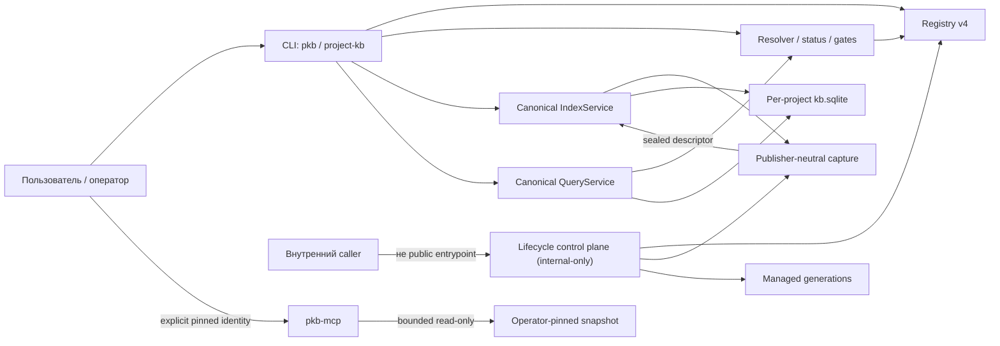
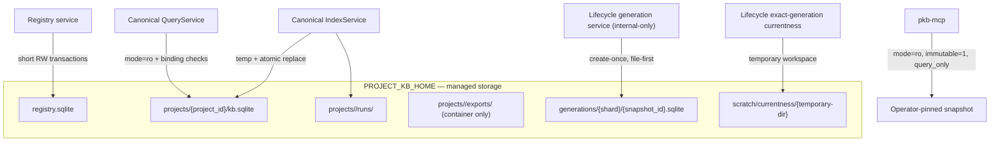
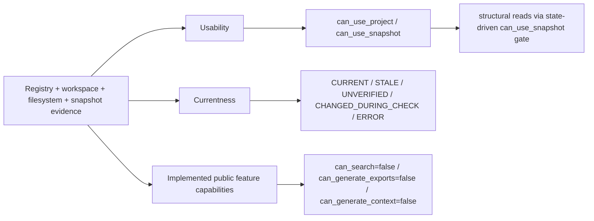

# Project KB Architecture

Project KB — замороженная portfolio/reference implementation. Этот документ — единственный технический владелец её текущей архитектуры и описывает реализованные границы системы и поддерживающие внутренние механизмы в их текущем виде, а не предполагаемое развитие системы.

## 1. Scope and source-of-truth rules

Project KB — локальная reference implementation для построения и чтения структурных снимков Git-проектов. Текущий публичный контракт намеренно узок: регистрация проектов, полная каноническая индексация, status/currentness, структурные lookup-операции и чтение явно закреплённого снимка через MCP.

Для технических утверждений действует следующий порядок источников:

1. исполняемый код и упаковка;
2. тесты, фиксирующие наблюдаемый контракт и fail-closed поведение;
3. этот документ как консолидированное описание текущего состояния.

Нормативные требования к записи, путям, Git, секретам и отказам принадлежат [Data Safety Policy](DATA_SAFETY_POLICY.md). Здесь они рассматриваются только в той мере, в какой определяют архитектурные границы.

Нужно различать две независимые версии форматов:

- registry schema имеет версию **4**;
- семантический SQLite snapshot schema имеет версию **2**.

Числа не являются версиями одного и того же формата. Registry хранит control-plane identity и lifecycle state; snapshot хранит захваченные структурные данные.

## 2. System context and component map

Текстовый эквивалент: публичный CLI работает с live registry, resolver, каноническим publisher и каноническим QueryService. Внутренний lifecycle control plane использует общий capture seam, но публикует только managed generations. Отдельный процесс `pkb-mcp` читает только переданный оператором и криптографически закреплённый snapshot; он не обращается к live registry, resolver, currentness или lifecycle. Публичной связи CLI/MCP с lifecycle API нет.

## 3. Components and ownership boundaries

| Компонент | Владелец ответственности | Публичная поверхность | Storage/state | Не владеет |
| --- | --- | --- | --- | --- |
| CLI application | Разбор команд и представление результата | `pkb`, `project-kb` | Не владеет данными | Registry schema, capture truth, SQLite publication |
| Registry service | Project/workspace identity, binding generations, операции и транзакции registry v4 | Команды регистрации через CLI | `registry.sqlite` | Snapshot contents и currentness proof |
| Resolver, status и gates | Сведение registry, filesystem, snapshot и verification evidence в status и разрешения | `status`, данные для capability gates | Эфемерный результат разрешения | Публикация и изменение registry |
| Publisher-neutral capture | Безопасное чтение Git population, построение, sealing и доказательство стабильности временного snapshot | Прямой публичный API не обещан | Временный snapshot у вызывающего publisher | Выбор конечного lane и смена pointer |
| Canonical `IndexService` | Полная каноническая сборка и атомарная публикация | `index` | `<PROJECT_KB_HOME>/projects/<project_id>/kb.sqlite`, `runs/` | Managed generations |
| Canonical `QueryService` | Resolver-gated структурные запросы к активному каноническому snapshot | `symbols`, `imports`, `inspect` | Read-only соединение к `kb.sqlite` | Generic/semantic search |
| Lifecycle control plane | Внутренние tasks/operations, immutable generations, selectors, comparisons и exact-generation reads | Нет публичного CLI/MCP entrypoint | Registry lifecycle tables и managed generations | Канонический `kb.sqlite` |
| Storage/home policy | Канонические пути, containment, non-redirected и file-identity проверки | Нет | Всё под `<PROJECT_KB_HOME>` | Продуктовые capability decisions |
| Frozen MCP transport | Bounded structural reads из одного operator-pinned snapshot | `pkb-mcp` и четыре MCP tools | Не создаёт persistent state; SQLite открывается read-only | Registry discovery, latest selection, currentness и mutation |

### 3.1. Registry v4 and workspace identity

Registry v4 разделяет логическую запись проекта и физическую identity checkout/worktree. Таблица workspaces — авторитетный владелец нормализованного root, repository identity, workspace state и binding generation. Для проекта существует ровно один PRIMARY workspace; одноимённые поля project record являются совместимой проекцией и защищены от drift инвариантами schema/service.

`register` создаёт исходную активную привязку. `relink` создаёт новое значение binding generation даже при возврате к тому же root и требует повторной индексации. `unregister` сначала захватывает ожидаемую workspace identity через compare-and-swap, а затем может удалить только вычисленный per-project storage root. Неоднозначная миграция, несовпадение identity и незавершённая lifecycle operation приводят к отказу.

### 3.2. Resolver, gates and status

Resolver объединяет registry record, активный PRIMARY workspace, состояние source root, канонический snapshot и, при запросе, currentness evidence. Он формирует status, compatibility/truth claims и независимые флаги availability. Gates используют эти факты явно; требование `SNAPSHOT_CURRENT` не заменяется простой читаемостью snapshot.

### 3.3. Publisher-neutral capture and canonical indexing

Capture pin-ит project/workspace/root/repository identity/binding, получает разрешённую Git population, безопасно читает допустимые файлы, записывает временный snapshot и возвращает его только после schema validation, sealing и повторной проверки terminal source/binding evidence. Capture не выбирает конечное хранилище.

Канонический `IndexService` владеет lane `<project storage>/kb.sqlite`: он вызывает capture, атомарно заменяет canonical file и затем повторно подтверждает active binding. Параметры `default` и `full` сейчас приводят к полной сборке; incremental publication отсутствует.

### 3.4. Canonical structural query path

`QueryService` сначала проходит resolver gate `can_use_snapshot`, затем открывает canonical snapshot в read-only режиме с active-binding callback. Binding и snapshot identity проверяются при подготовке и во время запроса. Доступны точные, списочные и prefix-oriented структурные операции над symbols, imports и path inspection; этот путь не реализует generic или semantic search.

### 3.5. Internal lifecycle control plane

Lifecycle — реализованный, но непубличный subsystem. Он управляет tasks и operations, публикует create-once managed generations, переводит aliases/selectors в точный snapshot identity, выполняет exact-generation reads и ограниченные deterministic comparisons. Он использует publisher-neutral capture, но не пишет canonical `kb.sqlite` и не добавляет публичную команду или MCP tool.

### 3.6. Frozen snapshot MCP transport

`pkb-mcp` стартует только с явной конфигурацией snapshot path и ожидаемых project/snapshot/hash/source-commit identities. При bootstrap процесс один раз хеширует весь файл, валидирует snapshot и закрепляет identity. Каждый структурный data query создаёт SQLite connection с `mode=ro`, `immutable=1` и `query_only`, устанавливает execution bound и повторно проверяет snapshot id; metadata tool использует уже проверенный bootstrap state. Transport не делает live registry resolution, не выбирает «latest» и не доказывает currentness.

## 4. Public entrypoints and capability contract

Runtime и executable contract определены упаковкой:

| Контракт | Текущее значение |
| --- | --- |
| Python | `>=3.14` |
| Основной CLI | `pkb = project_kb.cli.app:main` |
| CLI alias | `project-kb = project_kb.cli.app:main` |
| Frozen MCP server | `pkb-mcp = project_kb.transport.mcp_server:main` |

`pkb` и `project-kb` запускают одно приложение с командами `version`, `status`, `capabilities`, `register`, `projects`, `relink`, `unregister`, `index`, `symbols`, `imports` и `inspect`. Импортируемые Python-модули являются деталями реализации; стабильный public Python API не объявлен.

Замороженный capability contract:

| Capability | Состояние |
| --- | --- |
| Structural queries | Доступны при прохождении соответствующих snapshot gates |
| Generic/semantic search | Не поддерживается; `can_search=false` |
| Export generation | Не поддерживается; `can_generate_exports=false` |
| Context-pack generation | Не поддерживается; `can_generate_context=false` |
| Lifecycle orchestration | Internal-only, не публичный capability |

MCP surface состоит ровно из четырёх read-only tools: `get_snapshot_metadata`, `find_symbols`, `query_structural_records` и `inspect_paths`. Наличие универсального по форме `query_structural_records` означает bounded lookup по allowlisted structural datasets/fields, а не generic search.

## 5. Runtime and data flows

### 5.1. Registration, relink and unregister

`register` разрешает Git root, фиксирует repository/workspace identity и создаёт per-project storage. `relink` валидирует новый root, создаёт новую binding generation и переводит проект в состояние, требующее reindex. При незавершённой lifecycle work relink отказывается менять binding. `unregister` использует identity/CAS guards и удаляет только ожидаемый project storage; наличие lifecycle records ограничивает hard removal.

### 5.2. Canonical capture and publication

Канонический flow имеет порядок:

1. pin активной project/workspace binding;
2. bounded capture Git population в свежий временный файл вне source repository;
3. проверка schema, snapshot identity, sealing, source stability и binding;
4. атомарная замена canonical `kb.sqlite`;
5. registry bookkeeping и повторная проверка опубликованного snapshot против active binding.

Ошибка до атомарной замены сохраняет прежние canonical bytes. Если binding меняется уже после замены, новый файл помечается логически quarantined/unusable и операция завершается отказом; архитектура не обещает восстановление прежних bytes после этой publication boundary.

### 5.3. Canonical structural reads

CLI lookup вызывает resolver, требует `can_use_snapshot`, открывает канонический файл read-only и проверяет active binding до/во время чтения. Возвращаются только структурные records, соответствующие конкретной команде; выполнение кода целевого проекта не требуется.

### 5.4. Internal lifecycle generations

Lifecycle reserve-ит operation и snapshot id, получает sealed capture, проверяет размер/hash/witness и публикует файл в deterministic managed path по схеме file-first. Final file создаётся один раз без overwrite. Только после проверки файла registry transaction регистрирует AVAILABLE generation, меняет pointer через CAS и завершает operation. Конфликт после появления файла приводит к fail-closed регистрации orphaned state, а не к подмене существующего generation.

Aliases (`task baseline`, `latest working`, `final`, `project baseline`) сначала разрешаются в точный snapshot id. Exact-generation read повторно проверяет registry identity, размер, hash и snapshot metadata. Historical exact id может оставаться адресуемым, тогда как alias/currentness при смене active binding отказывают.

### 5.5. Operator-pinned MCP reads

Оператор запускает `pkb-mcp` с путём и полным ожидаемым identity contract. Bootstrap проверяет файл один раз и после этого обслуживает bounded read-only запросы к тому же immutable SQLite image. Структурный data query повторяет snapshot-id check при открытии connection, metadata tool возвращает закреплённые bootstrap metadata, а полный SHA-256 не вычисляется заново. Этот lane не публикует, не продвигает pointers и не выводит текущесть из имени файла или registry state.

## 6. Storage and snapshot ownership

Текстовый эквивалент: registry service единолично изменяет registry SQLite; canonical IndexService заменяет per-project `kb.sqlite`, а QueryService читает его с live binding checks. Internal lifecycle создаёт неизменяемые на уровне приложения managed generation files в отдельном глобальном lane и использует очищаемый временный каталог для exact-generation currentness. MCP читает выбранный оператором artifact независимо от managed-storage ownership и ничего в нём не изменяет.

| Путь относительно `<PROJECT_KB_HOME>` | Владелец и режим |
| --- | --- |
| `registry.sqlite` | Registry v4; короткие transactional writes и проверка schema |
| `projects/<project_id>/kb.sqlite` | Единственный текущий canonical snapshot проекта; атомарно заменяется `IndexService` |
| `projects/<project_id>/runs/` | Canonical run records и принадлежащие операции временные snapshot-файлы |
| `projects/<project_id>/exports/` | Зарезервированный storage container; capability генерации exports остаётся выключенным |
| `generations/<shard>/<snapshot_id>.sqlite` | Internal lifecycle; deterministic create-once generation, app-level immutable после публикации |
| `scratch/currentness/` | Родитель для очищаемых per-call verification directories |

Source repository не входит в managed storage и не является допустимым publication target. Operator-pinned MCP artifact может физически указывать на разрешённый snapshot, но MCP не приобретает право владения или записи.

## 7. Identity, provenance and active-binding invariants

Логический `project_id` недостаточен для доверия snapshot. Активная identity включает PRIMARY workspace, нормализованный root, repository identity и binding generation. Snapshot связывает с этой identity как минимум project id, repository identity, binding generation, source commit/state, snapshot id и build proof.

Основные инварианты:

- ровно один PRIMARY workspace владеет активным physical checkout identity проекта;
- relink всегда создаёт новую binding generation;
- canonical publication и canonical query должны совпасть с текущей active binding;
- snapshot id и binding перепроверяются на чувствительных границах, а не выводятся только из пути;
- generation pointer меняется только через ожидаемое предыдущее значение;
- registry migration или чтение с неоднозначной identity завершается отказом.

Значение provenance `LEGACY_CANONICAL` — текущее машинное имя canonical per-project lane, а не номер версии registry или snapshot.

## 8. Status, currentness, availability and capability semantics

Текстовый эквивалент: один набор evidence порождает три независимые оси. Usability определяет `can_use_project` и state-driven gate `can_use_snapshot`, через который разрешаются structural reads. Currentness сообщает результат отдельной проверки времени/содержимого. Implemented public feature capabilities отдельно фиксируют `can_search=false`, `can_generate_exports=false` и `can_generate_context=false`. Между осями нет перехода «snapshot читается ⇒ он current» или «snapshot читается ⇒ generic search доступен».

После успешной canonical publication читаемый и совместимый snapshot по умолчанию имеет status `SNAPSHOT_PRESENT_UNVERIFIED`, а не `OK`. Strong verification может дать `CURRENT`, `STALE`, `CHANGED_DURING_CHECK` или `ERROR`; удалённый fast-путь возвращает `UNVERIFIED` с причиной `fast_verification_removed` и не создаёт verification timestamp. `CURRENT` означает только совпадение в момент `verified_at`, при стабильном bounded observation; это не бессрочная гарантия.

`can_use_snapshot` допускает структурное чтение совместимого snapshot даже при `UNVERIFIED` или `STALE`, если другой gate не требует currentness. Gate `SNAPSHOT_CURRENT` проверяется отдельно. `can_search`, `can_generate_exports` и `can_generate_context` остаются `false` независимо от читаемости и currentness.

## 9. Safety and fail-closed boundaries

Архитектура использует несколько независимых барьеров:

- source repository читается без записи; целевые Python-модули не импортируются и не выполняются;
- Git runner принимает только allowlisted read-only команды; временный index использует отдельный `GIT_INDEX_FILE` вне source repository;
- hard-secret basenames/suffixes классифицируются до чтения содержимого, redirects остаются metadata-only;
- path traversal, redirected managed storage, hardlinks для final generation artifacts и смена file identity приводят к отказу;
- capture обязан доказать terminal source и binding stability до передачи sealed descriptor;
- registry writes ограничены короткими транзакциями с foreign keys и CAS/identity guards;
- canonical SQLite читается через read-only reader с binding checks;
- generation publication create-once и никогда не перезаписывает существующий final file;
- frozen MCP сочетает bootstrap hash/identity validation с `mode=ro`, `immutable=1`, `query_only`, allowlists и ресурсными bounds.

Точные нормативные формулировки и допустимые persistent writes определены в [Data Safety Policy](DATA_SAFETY_POLICY.md).

## 10. Public versus internal surfaces

| Поверхность | Классификация | Что разрешено |
| --- | --- | --- |
| `pkb` / `project-kb` | Public, frozen | Registry operations, status/capabilities, full canonical indexing, canonical structural lookup |
| `pkb-mcp` | Public, frozen | Четыре bounded read-only tools над одним operator-pinned snapshot |
| Publisher-neutral capture | Internal seam | Построение sealed snapshot для явно выбранного publisher |
| Lifecycle tasks/operations/selectors/comparisons | Internal-only | Managed generations и exact-generation operations для внутренних callers |
| Python module imports | Implementation detail | Стабильность как public API не обещана |

Internal lifecycle нельзя считать скрытой CLI-функцией: entrypoint, команда и MCP tool для него отсутствуют. Аналогично MCP не является alternate live frontend к registry или canonical resolver; это отдельный frozen-reader process.

## 11. Known limitations and non-capabilities

- Каноническая индексация всегда полная; incremental indexing отсутствует.
- Структурный lookup не является generic, full-text, fuzzy, vector или semantic search.
- Export generation и context-pack generation не реализованы, хотя `exports/` существует как storage container.
- Lifecycle subsystem не имеет публичного executable contract.
- MCP требует заранее выбранный artifact и полную pinned identity; он не находит latest snapshot и не доказывает currentness.
- Currentness является bounded observation с timestamp, а не durable freshness lease.
- Snapshot semantic schema v2 и registry schema v4 развиваются как разные контракты.
- App-level immutability managed generation обеспечивается create-once publication и проверками; это не обещание OS-level запрета на изменение файла внешним процессом.

## 12. Related documentation

- [README](../README.md) — пользовательское введение и команды.
- [Data Safety Policy](DATA_SAFETY_POLICY.md) — нормативные правила данных, путей, Git, публикации и отказов.
