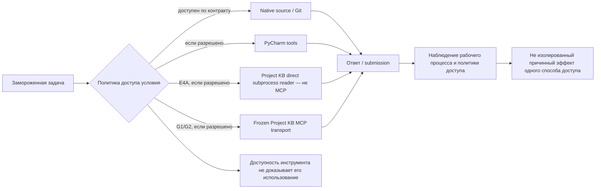
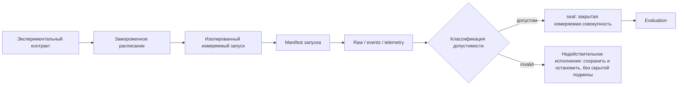

# Project KB Benchmark Methodology

## 1. Scope and purpose

Этот документ описывает методологию экспериментального стенда Project KB: исследовательский вопрос, единицу измерения, условия доступа, изоляцию запусков, замороженные входы, доказательную цепочку, допустимость, закрытие совокупности и границы интерпретации. Он отвечает на вопрос «как измеряли»; сравнение измеренных итогов находится вне его границ.

Исследовательский вопрос формулируется узко: как разные заранее заданные политики доступа поддерживают выполнение фиксированных инженерных и аудиторских задач над одним замороженным исходным состоянием. Наблюдаемой системой является весь рабочий процесс внутри условия — модель, разрешённые источники, инструменты, ограничения и представленный ответ. Дизайн сам по себе не выделяет причинный эффект одного инструмента или одного способа извлечения данных.

Здесь рассматриваются методологические поколения `E4A`, `G1` и initial N3 поколения `G2`. Подробные численные итоги, сравнительная интерпретация и обоснование заморозки продукта намеренно не публикуются.

## 2. What the benchmark measures

Стенд измеряет выполнение заранее зафиксированной задачи в заранее зафиксированном условии доступа. Для каждого запуска он сохраняет несколько разных видов наблюдений:

- ответ, который измеряемый процесс передал для проверки;
- целостность исполнения и соответствие контракту;
- машинные события и эксплуатационную телеметрию там, где она инструментирована;
- результат канонического оценивания только после прохождения требуемых границ допустимости и закрытия совокупности.

Условие задаёт доступные инструменты и источники, но не обязывает процесс использовать каждый из них. Поэтому имя условия нельзя считать доказательством фактического обращения к PyCharm, direct reader или MCP. Фактическое использование устанавливается отдельно по событиям и телеметрии, если соответствующая трассировка присутствует и достаточна.

Стенд не измеряет «чистую ценность Project KB» в отрыве от остальных разрешённых средств. Он также не доказывает универсальность результата для других репозиториев, задач, моделей, клиентов или моментов времени.

## 3. Methodology lineage

### E4A: поколение до MCP-транспорта Project KB

`E4A` включала 3 задачи и 4 условия — `NATIVE`, `PYCHARM`, `PKB`, `HYBRID`. Каждой точной паре задача×условие соответствовал один измеряемый запуск: 3 × 4 = 12 ячеек, `N=1` на точную ячейку.

Термин «до MCP» относится именно к транспорту Project KB. В `PKB` и `HYBRID` доступ к снимку выполнялся через task-neutral Python reader, вызываемый controller как прямой subprocess; это не был MCP-вызов. Условие `PYCHARM` уже могло использовать PyCharm MCP. Во всех четырёх условиях сохранялись native read-only доступ к исходникам и read-only Git inspection, поэтому именованное условие описывало политику доступов, а не эксклюзивный источник доказательств.

### G1: отказ на границе допуска

После появления замороженного структурного MCP-транспорта Project KB условия-кандидаты получили идентификаторы `PYCHARM`, `PKB_MCP` и `HYBRID_MCP`, а дизайн перешёл к повторным измеряемым запускам. В `G1` схема транспорта для структурированного вывода была отклонена валидатором как `invalid_json_schema` до содержательного представленного ответа.

Следовательно, `G1` — недопущенное поколение эксперимента до образования валидной совокупности измеряемых запусков. Это отказ совместимости admission/schema, а не низкий показатель и не отрицательный результат производительности какого-либо условия.

### G2 initial N3: исправленный повторный дизайн

`G2` использовала исправленную проекцию транспортной схемы с последующей проверкой по канонической схеме ответа. Initial N3 заранее фиксировала 2 задачи, 3 условия и 3 повторных измеряемых запуска для каждой точной пары задача×условие: 2 × 3 × 3 = 18 ячеек. Все ячейки initial N3 были помечены как измеряемые, а не диагностические; расписание было заморожено до их исполнения.

| Измерение | E4A PRE-MCP | G2 INITIAL N3 |
| --- | --- | --- |
| Назначение | Квалификация четырёх политик доступа до MCP-транспорта Project KB | Повторная проверка трёх политик с замороженным MCP-транспортом Project KB |
| Путь Project KB | Direct subprocess/controller reader к read-only снимку; не MCP | `pkb-mcp` с явно закреплённой идентичностью и read-only доступом к снимку в `PKB_MCP` и `HYBRID_MCP` |
| Задачи | 3 | 2 |
| Условия | `NATIVE`, `PYCHARM`, `PKB`, `HYBRID` | `PYCHARM`, `PKB_MCP`, `HYBRID_MCP` |
| Повторных запусков на точную пару задача×условие | 1 (`N=1`) | 3 (`N=3`) |
| Измеряемые ячейки | 12 | 18 |
| Изоляция | Отдельная запланированная сессия для каждой точной ячейки; повторов той же ячейки не было | Свежий процесс/сессия Codex и отдельные артефакты на каждый повтор; исходное состояние повторно проверялось по замороженному контракту |
| Расписание | Явный замороженный порядок 12 сессий | Явное последовательное расписание 18 ячеек, замороженное до исполнения |
| `seal` | Формального `collection_seal`, применённого позднее в G2, не было | Требуемое закрытие полной допустимой совокупности с привязкой к расписанию и raw-артефактам |
| Оценивание | Отдельное финальное оценивание сохранённых запусков | Оценивание допускается только после `seal` и проверяет его связи |
| Главная методологическая граница | `N=1` на точную ячейку и смешение разрешённых путей доступа | Малое `N=3`, смешение политик доступа и неполная фиксация происхождения producer и среды выполнения |

## 4. Experimental unit model

**Задача** — фиксированная инженерная или аудиторская постановка с замороженными входами, областью исходников и схемой ответа.

**Условие** — замороженная политика разрешённых источников, инструментов и параметров среды. Она определяет возможность доступа, а не обязательное использование каждого разрешённого средства.

**Повторный измеряемый запуск** — независимый запуск той же пары задача×условие при том же поколенческом контракте. Канонический `replicate_id` сохраняется в машинных артефактах.

**Ячейка** — точная единица расписания: `task × condition × replicate`. В `E4A` отдельного измерения replicate не было, поэтому каждая пара задача×условие имела единственный запуск.

**Совокупность измеряемых запусков** — полный заранее объявленный набор измеряемых ячеек конкретной коллекции/поколения. Диагностические запуски должны иметь отдельную классификацию и не могут незаметно пополнять эту совокупность.

### Контракт и расписание

Экспериментальный контракт фиксирует идентичность поколения, задачи, условия, политику повторов, требования к доказательным данным, правила допустимости и недействительности, а также предпосылки `seal` и оценивания. Он может также закреплять модель, схему ответа, идентичность исходников и доступных providers.

Расписание превращает контракт в точный план исполнения: перечисляет `run_id`, `task_id`, `condition_id`, `replicate_id`, порядок, а также измеряемую или диагностическую классификацию каждой ячейки. После начала измеряемого исполнения расписание нельзя сокращать, менять местами или переписывать ради удаления неудобной ячейки. Для иного состава требуется отдельно разрешённое новое поколение либо явно диагностический запуск вне измеряемой совокупности.

## 5. Isolation and frozen inputs

Для повторных измеряемых запусков `G2` контракт и harness обеспечивали следующую изоляцию:

- каждый запуск создавал свежий процесс Codex и одноразовую сессию (`ephemeral_session`); `resume` был запрещён;
- предыдущие ответы, оценки и сводки других запусков не передавались в контекст запроса;
- создавались свежие траектория модели, event stream и пространство имён вывода;
- для MCP-условий процесс Project KB MCP принадлежал свежей сессии Codex;
- manifest, raw result и events сохранялись раздельно для каждого `run_id`;
- исполнение следовало замороженному последовательному расписанию.

Initial G2 использовала один detached `persistent_verified_git_worktree` на закреплённом commit, а не создавала новый физический worktree-каталог для каждого повтора. Перед запуском harness заново проверял авторитетные исходники и этот worktree, после запуска подтверждал неизменность идентичности и состояния, а результаты хранил вне исходного рабочего корня. Поэтому «свежее состояние проекта» здесь означает независимо перепроверенное замороженное состояние по контракту, а не новый checkout для каждой ячейки.

Общие неизменяемые авторитетные входы — исходный commit/tree и закреплённый snapshot — могли повторно использоваться между запусками. Такое повторное использование является общей замороженной входной базой, а не переносом состояния разговора или сессии.

Граница изоляции намеренно уже системной изоляции на уровне ОС: это изоляция процесса, сессии, контекста и пространства артефактов, но не отдельная учётная запись ОС, VM или container на каждый запуск. Нельзя приписывать стенду более сильную системную изоляцию.

### Замороженные идентичности и ограничение provenance

В зависимости от поколения артефакты связывали source commit/tree, идентичность кода Project KB, snapshot ID и SHA-256, экспериментальный контракт, схему, расписание, модель и доступную версию Codex. Полнота этой связи различалась между поколениями.

Initial G2 manifests не полностью фиксировали SHA producer harness, точный Python executable и точный `uv` executable. Это ограничивает доказуемость точного происхождения producer и среды выполнения при повторении. Оно не является автоматическим основанием объявлять недействительными уже сохранённые байты, чьи собственные хеши и связи contract→schedule→manifest→raw→seal остаются проверяемыми.

## 6. Conditions and access-policy model

В `E4A` базовый native source/Git доступ сохранялся во всех условиях. `PYCHARM` добавляла разрешённый набор PyCharm tools, `PKB` — direct reader Project KB, а `HYBRID` — оба дополнительных пути. В поколениях MCP `PYCHARM` разрешала native и PyCharm, `PKB_MCP` — native и закреплённый Project KB MCP, `HYBRID_MCP` — все три пути.

Текстовый эквивалент: замороженная задача выполняется внутри условия, которое открывает native source/Git и, в зависимости от поколения и `condition_id`, PyCharm, direct reader либо Project KB MCP. Все фактически выбранные пути сходятся в одном ответе. Поэтому наблюдение относится к рабочему процессу и политике доступа; причинный вклад одного способа доступа без дополнительного контроля не выделен.

События и телеметрия могут подтвердить отдельные обращения там, где они зафиксированы. Сам condition ID такого подтверждения не даёт, а отсутствие зафиксированного вызова нельзя автоматически превращать в вывод о невозможности доступа.

## 7. Evidence pipeline and artifact roles

Текстовый эквивалент доказательной цепочки: контракт → замороженное расписание → изолированный измеряемый запуск → manifest → raw/events/telemetry → классификация допустимости → `seal` → evaluation. Недействительное исполнение ответвляется до `seal`: оно сохраняется как факт исполнения, но не становится валидным измерением с низкой оценкой и не заменяется молча.

Manifest физически подготавливается до запуска и сопровождает его; положение после run на схеме показывает порядок проверки доказательной связи, а не порядок записи байтов.

| Артефакт | Методологическая роль | Не доказывает сам по себе |
| --- | --- | --- |
| Contract | Замороженные правила поколения: задачи, условия, повторы, схемы, допустимость и предпосылки | Что запуск состоялся или прошёл допустимость |
| Schedule | Точный заранее объявленный набор, порядок, `run_id`, `replicate_id` и измеряемая/диагностическая классификация | Завершённость либо качество запусков |
| Manifest | Идентичность и конверт исполнения конкретного запуска, ссылки на контракты и ожидаемые артефакты | Фактическое исполнение или полное происхождение среды выполнения |
| Raw result | Машинный конверт исполнения: status, validation, ссылки, submission и собранные наблюдения | Каноническую оценку ответа |
| Events | Хронологическая цепочка событий процесса и инструментальных действий | Научную допустимость без остальных проверок |
| Telemetry | Производные эксплуатационные наблюдения и трассы инструментов/providers там, где они инструментированы | Причину результата или независимый причинный эффект |
| Submission | Структурированный ответ измеряемого процесса, передаваемый evaluator | Целостность всего процесса либо допустимость ячейки |
| Seal | Закрытие полной допустимой совокупности и привязка schedule/raw identities и хешей | Статистическую значимость, безошибочность evaluator или внешнюю валидность |
| Evaluation | Канонический исторический вывод закреплённого evaluator для закрытого поколения | Универсальную истину, готовность к промышленной эксплуатации или право переписать историю задним числом |

## 8. Eligibility, sealing and evaluation

### Допустимость и недействительность

Завершение процесса ещё не делает запуск допустимым. Для initial G2 классификация учитывала успешный запуск и код завершения, отсутствие тайм-аута, наличие итогового JSON-сообщения, соответствие канонической схеме, принятие схемы транспорта, готовность обязательных providers, неизменность исходников, соблюдение списка разрешённых инструментов/providers, завершение корневого процесса, допустимое состояние workspace и разбираемый event stream.

`UNCLASSIFIED_INVALID` — машинное состояние недействительного исполнения, для которого нет подтверждённой инфраструктурной классификации более узкого типа. Это не низкий score, не валидный результат и не разрешение повторить ту же измеряемую ячейку. Raw/events такого запуска остаются отдельными доказательными данными о состоявшейся попытке.

`G1` остановилась раньше содержательной оценки: structured-output schema не прошла admission. Такая ошибка принадлежит границе допустимости эксперимента, а не шкале производительности.

### Однократность запуска, запрет повтора и подмены

Замороженное расписание принимало только `run_id`, встречающийся в нём ровно один раз. Пространство имён raw/events создавалось с семантикой `CreateNew`; существующее назначение запрещало повторную запись. Перед переходом к следующей ячейке harness требовал, чтобы все предыдущие ячейки расписания существовали и были `SCIENTIFICALLY_ELIGIBLE`; недействительное исполнение останавливало последовательное продвижение.

Поэтому тайм-аут или иное недействительное исполнение в однократной измеряемой ячейке расходует запланированную попытку. Повтор не может молча подменить исходную ячейку, а заранее объявленный состав нельзя уменьшить после наблюдения. Новый запуск требует отдельно разрешённого поколения либо явной диагностической классификации; он не становится задним числом частью прежней измеряемой совокупности.

### `seal`

`Seal` — формальный create-once артефакт закрытия коллекции. Harness отказывался создавать его при отсутствующей ячейке расписания, недопустимой классификации, невалидном raw result или неполной совокупности. Успешный `seal` связывает контракт поколения, хеш замороженного расписания, список запланированных/сохранённых запусков и хеш каждого raw result.

`Seal` означает только: «эта заранее объявленная совокупность закрыта по контракту поколения». Он не означает статистическую значимость, корректность evaluator, внешнюю валидность, причинную атрибуцию, готовность к промышленной эксплуатации или общность за пределами замороженного эксперимента. Коллекцию без требуемого `seal` нельзя представлять как завершённую каноническую измеряемую совокупность.

### Evaluation

Evaluation является последующей операцией: harness требует существующий `seal`, повторно сверяет хеш расписания и каждый закреплённый raw hash, затем применяет закреплённый контракт evaluator. Артефакт evaluation также создаётся без перезаписи и остаётся канонической историей этого поколения.

Если позднее обнаруживается дефект evaluator, исходный артефакт не переписывается молча. Диагностика, исправленное отображение или контрфактическая интерпретация должны сохраняться отдельно и не становятся каноническим повторным оцениванием без нового формального процесса.

## 9. Reproducibility and validity limits

**Воспроизводимость артефактов** означает возможность проверить замороженные contracts/schedules, manifests отдельных запусков, raw/events/telemetry, хеши и связи `seal`/evaluation.

**Процедурная воспроизводимость** означает возможность повторить процесс при наличии эквивалентной среды. Она не обещает идентичный текст LLM, время выполнения, счётчики токенов или неизменность внешнего сервиса модели во времени.

**Интерпретационная воспроизводимость** означает, что независимый читатель может установить, что именно измерялось, какие переменные не контролировались и какие причинные или статистические выводы дизайн не поддерживает.

| Ограничение | Почему важно | Затронутое поколение | Допустимая интерпретация | Запрещённая интерпретация |
| --- | --- | --- | --- | --- |
| `E4A N=1` на точную ячейку | Один запуск не оценивает вариативность внутри ячейки | `E4A` | Описание конкретных 12 запусков и их контрактов | Полная повторяемость, статистическая значимость или широкая генерализация |
| `G2 N=3` на точную ячейку | Малое число повторов показывает лишь ограниченную вариативность | `G2` initial N3 | Описательное сравнение внутри замороженного плана | Сильный вывод о генеральной совокупности или универсальном ранжировании |
| Смешение политики доступа | Условие может разрешать несколько источников и инструментов | Все поколения | Результат всего рабочего процесса политики доступа | Изолированный причинный эффект PKB, MCP или PyCharm |
| Фактическое использование не обязательно | Разрешённый инструмент мог не вызываться | Все поколения | Использование утверждается только по отдельным events/telemetry, где достаточно трассировки | Вывод «condition ID означает tool call» |
| Недетерминизм LLM | Повторные запуски могут расходиться при одинаковом контракте | Все поколения | Наблюдение ограниченной вариативности между запусками | Обещание идентичных ответов и эксплуатационных наблюдений |
| Специфичность замороженных задач и исходников | Задачи, source, snapshot, model и environment закреплены | Все поколения | Выводы внутри этих замороженных границ | Перенос на любой repository, model, client или момент времени |
| Неполное происхождение producer и среды | Initial G2 manifests не связывают harness SHA и точные Python/`uv` executables | `G2` initial N3 | Аудит сохранённых байтов и записанных identity с явной оговоркой | Утверждение о полностью идентичной исторической среде выполнения |
| Формальный статистический вывод не проводился | Дизайн и малые N не образуют исследования с формальным статистическим выводом | `E4A`, `G2` | Описательная методологическая интерпретация | Статистическая значимость, эффект в генеральной совокупности или доверительные утверждения |
| Остановленное незапечатанное расширение | Неполная коллекция не прошла границу закрытия | Расширение `G2` | Пример fail-closed и однократной дисциплины | Объединение с initial N3 или представление как завершённой измеряемой совокупности |

## 10. Project-specific implementation and reusable pattern

Специфичными для Project KB остаются точные задачи и condition IDs, авторитетные исходники/снимки, controller и harness, схема evaluator, Project KB MCP tools и имена сохраняемых артефактов. Эти детали были построены для конкретного замороженного репозитория и экспериментальной линии.

Потенциально переносимым является архитектурный паттерн: замороженный вопрос и контракт → фиксированное расписание → изолированные измеряемые исполнения → неизменяемые доказательные данные отдельных запусков → классификация допустимости → закрытая измеряемая совокупность → каноническое evaluation → отдельно сохранённые diagnostics/errata.

Текущая реализация не является универсальным benchmark framework, стандартом MCP или промышленной платформой измерений. Выделение паттерна в отдельный обобщённый проект экспериментального стенда возможно как будущая инженерная идея, но не входит в frozen Project KB и не является активным планом развития.

## 11. Related documentation

- [Architecture](ARCHITECTURE.md) — текущие компоненты, frozen MCP transport и границы продукта.
- [Data Safety Policy](DATA_SAFETY_POLICY.md) — правила чтения, identity, snapshot и fail-closed behavior.
- [Development History](DEVELOPMENT_HISTORY.md) — инженерная последовательность поколений без передачи этому документу владения результатами.
- [README](../README.md) — публичное введение и поддерживаемая пользовательская поверхность.

Подробные измеренные результаты и их интерпретация находятся вне границ этой методологии.
