# Project KB Development History

## 1. Scope and evidence rules

Этот документ фиксирует инженерную историю Project KB: переходы в модели данных и доверия, квалификационную линию E4A/G1/G2, остановленное расширение и решение о заморозке продукта. Это не полный changelog и не отчёт с подробными benchmark-результатами.

Исторические утверждения опираются на сохранённые machine-readable contracts, schedules, manifests, raw/event chains, seals, evaluations, исходный код harness/evaluator и записи решений. Старые обзорные тексты использовались только как навигация и не считались достаточным доказательством сами по себе. Текущее состояние сверено с действующей архитектурой, policy безопасности, упаковкой и узкими source-level контрактами.

Ниже различаются:

- **исторический факт** — состояние, подтверждённое сохранённым первичным evidence;
- **текущее состояние** — контракт замороженной реализации на момент этого документа;
- **ограниченная интерпретация** — инженерный вывод для решения о scope, а не научное доказательство.

## 2. Evolution at a glance

```mermaid
flowchart LR
    A["Structural snapshot and trust model"] --> B["Registry v4 and internal generations"]
    B --> C["E4A: pre-MCP qualification"]
    C --> D["Frozen structural MCP transport"]
    D --> E["G1: schema admission failure"]
    E --> F["G2: complete initial N3"]
    F --> G["Bounded evaluator diagnosis"]
    G --> H["Halted r4/r5 expansion"]
    H --> I["Product freeze"]
```

Текстовый эквивалент: продукт прошёл путь от канонического структурного snapshot и усиления trust/identity к registry v4 и отдельному internal lifecycle; затем состоялись pre-MCP квалификация E4A, добавление закреплённого MCP transport, неудачный admission G1, полный initial N3 поколения G2, ограниченная диагностика evaluator и остановка expansion перед заморозкой.

## 3. Product and architecture milestones

| MILESTONE | WHAT CHANGED | WHY IT MATTERED | EVIDENCE BASIS | FINAL STATUS |
| --- | --- | --- | --- | --- |
| Канонический structural snapshot | Scanner, indexer и semantic snapshot schema v2 были сведены в полный capture/publication flow | Структурные факты стали воспроизводимым локальным артефактом, а не набором task-specific извлечений | Product source history, snapshot schema и focused tests | Сохранён как canonical workflow |
| Trust, identity и currentness | Усилены Git population, path/secret guards, repository identity и отдельная проверка currentness | Читаемость snapshot перестала подменять доказательство его актуальности | Trust/currentness source, safety tests и текущая policy | Сохранено; availability и currentness разделены |
| Registry v4 и publication lanes | Physical workspace identity и binding generations стали авторитетными; canonical publication отделена от managed generations | Relink, publication и чтение получили явные identity/CAS границы | Registry v4 schema, lifecycle source и сохранённое registry evidence | Registry v4; lifecycle internal-only |
| E4A pre-MCP | Квалификационная матрица использовала direct subprocess/controller adapter к PKB snapshot | Появилась полная историческая baseline-популяция до MCP | Stand manifest, condition contracts, run order и final evaluation | 12-cell population; `PARTIALLY_REPLICATED` |
| Frozen structural MCP transport | Добавлен `pkb-mcp` для bounded read-only доступа к operator-pinned snapshot | Snapshot стал доступен через стабильный transport без live registry/latest semantics | Packaging, transport source и pinned identity checks | Реализован и заморожен |
| G1 admission failure | Первый MCP generation не прошёл structured-output/schema admission | Ошибка transport contract была отделена от product performance | G1 contract, 18-cell schedule и сохранённые failure chains | Invalid generation; measured population отсутствует |
| G2 initial N3 | Исправленный transport projection допустил полную MCP-популяцию; затем выявлен evaluator ID mismatch | Появился первый complete sealed/evaluated MCP evidence set и граница корректной интерпретации | G2 schedule, 18 raw chains, seal, evaluation, harness и evaluator | Initial N3 завершён; diagnosis неканонический |
| Expansion stop | После четырёх eligible cells следующая попытка сохранилась invalid; дальнейшие cells не запускались | Fail-closed остановка не позволила достроить population задним числом | Expansion schedule, manifests, five raw/event pairs и absence inventory | Incomplete; seal/evaluation отсутствуют |
| Frozen public contract | Поверхность была сужена до доказанных structural capabilities; активное product/benchmark расширение закрыто | Финальное состояние стало честным portfolio/reference contract без roadmap-обещаний | Current source, capability flags, architecture и freeze decision evidence | Product frozen |

## 4. Experimental qualification lineage

### E4A: pre-MCP baseline

**Исторический факт.** E4A предшествует MCP transport Project KB. В условиях PKB доступ выполнялся через подготовленный direct subprocess/controller path: task-neutral adapter открывал закреплённый SQLite snapshot read-only. Это не был MCP-вызов. Условия PKB, HYBRID и PYCHARM при этом сохраняли read-only доступ к native source и Git; именованная retrieval-среда не была эксклюзивным источником доказательств.

Полная evaluated population включала 12 task×condition cells. В каждой точной cell был один run (`N=1`), поэтому population классифицирована как `PARTIALLY_REPLICATED`: паттерн повторился между разными задачами, но same-cell replication не проводилась. E4A установила, что tested workflows могли давать корректный результат в разрешённых access conditions. Она не изолировала причинный вклад PKB, не доказала статистическую значимость или общую превосходность.

### G1: MCP admission failure

**Исторический факт.** G1 был первым поколением перехода к MCP conditions и имел frozen 18-cell schedule. Выполнение остановилось на admission: structured-output schema содержала `uniqueItems`, не допускавшийся response-format validator. Сохранённые failure chains показывают schema rejection до появления содержательной submission.

Следовательно, G1 не установил валидную measured population; для него нет действительных seal и evaluation. Это инженерный admission failure, который изменил transport projection следующего поколения, а не отрицательный результат производительности MCP.

### G2 initial N3: complete MCP population

**Исторический факт.** В G2 transport schema projection устранил G1 admission incompatibility. Initial N3 содержит 18 scientifically eligible persisted runs: две задачи, три conditions и три replicates. Seal фиксирует 18 planned, 18 persisted, 0 failed и `complete=true`; evaluation привязана к этому seal и включает все 18 valid measured runs.

G2 initial N3 стал первой полной sealed/evaluated MCP population. Его artifact integrity было достаточно для ограниченных продуктовых и экспериментальных решений, но не для утверждений об общей превосходности или чистом causal effect конкретного retrieval provider.

### Evaluator erratum

**Исторический факт.** Replicated harness передавал condition IDs `PKB_MCP` и `HYBRID_MCP` без normalization в legacy evaluator, который распознавал только `PKB` и `HYBRID`. Для новых IDs формировался пустой evidence allowlist, поэтому каждая candidate cell теряла один балл по критерию evidence discipline.

Mapping-only view использовался только как диагностический counterfactual для ограниченной интерпретации candidate correctness. Он не является canonical reevaluation: исходный evaluation artifact не переписывался, новая официальная score population не создавалась.

### Halted r4/r5 expansion

**Исторический факт.** В общей последовательности Cells 19–22 дали eligible evidence. Cell 23 была consumed once и persisted как `UNCLASSIFIED_INVALID`; сохранённые reason codes фиксируют превышение frozen timeout и nonzero-or-missing inner process exit. Cells 24–30 не запускались.

Expansion не была sealed или evaluated. Formal N5 не существует, а G3 не создавался. Eligible данные Cells 19–22 остаются сохранённым частичным evidence, но не превращают незавершённую collection в новую формальную population.

## 5. Major decisions and pivots

1. **Структурный snapshot вместо расширения смысла запроса.** Project KB закрепил точные и bounded structural reads над symbols, imports и paths. Это отделило доказанный lookup contract от generic, fuzzy, vector или semantic search.
2. **Identity важнее удобного пути.** Project/workspace binding generation, repository identity и snapshot metadata стали обязательными частями trust boundary. Relink означает новую binding generation и требует повторной индексации.
3. **Currentness — отдельная ось.** Snapshot может быть совместимым и читаемым, но `UNVERIFIED` или `STALE`; usability не повышается автоматически до claims о currentness.
4. **Два publication lane.** Canonical `kb.sqlite` остаётся владельцем обычного CLI flow, а create-once managed generations принадлежат отдельному internal lifecycle. Один lane не подменяет другой.
5. **MCP как pinned reader, не live frontend.** Transport намеренно читает один operator-pinned artifact, не разрешает registry, не выбирает latest generation и не заявляет currentness.
6. **Неподдерживаемые возможности оставлены выключенными.** Перед freeze публичный contract был выровнен с реализацией вместо добавления функций ради полноты surface.
7. **Диагностика не переписывает canonical evidence.** Evaluator mismatch изменил интерпретацию candidate differences, но не стал основанием для ретроактивного изменения evaluation или завершения expansion.

Текущая реализация benchmark специфична для Project KB. Архитектурный паттерн — frozen contracts, isolated runs, manifests/evidence, seal and evaluation — имеет потенциал более широкого повторного использования. Это не делает существующий harness универсальной или production benchmark platform.

## 6. Failures, corrections and bounded lessons

- **G1 schema admission failure.** Canonical answer schema нельзя было напрямую использовать как transport schema. G2 ввёл отдельную projection и последующую canonical validation. Урок: transport admission должен проверяться до расходования measured population.
- **Evaluator condition-ID mismatch.** Artifact chain и валидность runs сохранились, но candidate evidence-discipline scoring был систематически смещён. Урок: совместимость IDs между harness и evaluator является частью evaluation contract, а диагностическая поправка должна оставаться явно неканонической.
- **Cell 23 и остановка expansion.** Timeout и invalid persisted state не были скрыты, заменены или повторены. Урок: consumed attempts и frozen order важнее желания получить полную матрицу после сбоя.
- **Capability/documentation drift.** Финальная сверка устранила устаревшие представления о generic search, генерации exports/context packs и публичном lifecycle. Урок: наличие storage или внутреннего subsystem не равнозначно публичной capability.

Общий вывод ограничен tested lineage. Доступность provider не доказывает его фактическое использование; сохранность измерения не гарантирует безошибочность evaluator; отрицательное или неоднозначное evidence может быть достаточным для stop decision, не становясь доказательством общей непригодности продукта.

## 7. Retained, deferred and intentionally absent scope

### Retained

- canonical full structural snapshot workflow и semantic snapshot schema v2;
- registry v4, workspace identity и binding generations;
- trust/currentness boundaries с отдельными availability gates;
- publisher-neutral capture и разделение canonical/managed publication;
- реализованный internal lifecycle generation lane;
- frozen operator-pinned `pkb-mcp` и bounded structural reads.

### Deferred / not pursued further

- новые experiment generations после остановленной expansion;
- дальнейшая benchmark optimization под конкретные задачи;
- извлечение generic benchmark framework из Project-KB-specific harness.

Эти пункты фиксируют остановленный scope, а не активный roadmap.

### Intentionally absent public capabilities

- generic или semantic search;
- export generation;
- context-pack generation;
- public lifecycle API, CLI command или MCP tool.

## 8. Freeze decision and final state

### Historical facts

- К моменту freeze стабилизировались canonical capture/publication, registry v4 identity model, trust/currentness boundaries, internal generation lane и pinned structural MCP transport.
- E4A осталась complete pre-MCP historical baseline с `N=1` на exact cells; G1 остался invalid admission generation; G2 initial N3 завершён и sealed/evaluated.
- Evaluator mismatch документирован без перезаписи canonical evaluation.
- Expansion остановлена после Cell 23; Cells 24–30 не выполнялись; formal N5 и G3 отсутствуют.
- Сохранены как успешные, так и отрицательные/неоднозначные evidence states; продолжение product и benchmark expansion закрыто.

### Bounded interpretation

Freeze — инженерное и продуктовое решение, а не научный результат. Для portfolio/reference цели критические product semantics были достаточно стабильны; дополнительная benchmark expansion имела уменьшающуюся decision value; локальный evaluator defect можно было честно ограничить erratum без открытия нового product cycle. Уже сохранённые отрицательные и неоднозначные наблюдения были достаточны, чтобы отвергнуть упрощённый тезис «PKB всегда выигрывает», но не доказать общую superior или inferior performance.

Текущее состояние — frozen portfolio/reference implementation, а не production-readiness claim. Registry остаётся v4; lifecycle реализован, но internal-only; `pkb-mcp` реализован как frozen/operator-pinned reader; public lookup остаётся structural. `can_search`, `can_generate_exports` и `can_generate_context` остаются `false`, а snapshot usability не считается доказательством currentness.

## 9. Related documentation

- [Architecture](ARCHITECTURE.md) — текущие компоненты, ownership boundaries и runtime flows.
- [Data Safety Policy](DATA_SAFETY_POLICY.md) — нормативные правила данных, Git, paths, publication и fail-closed behavior.
- [README](../README.md) — пользовательское введение и доступные команды.

Подробные benchmark methodology, score tables и run-level telemetry намеренно не входят в эту историю.
