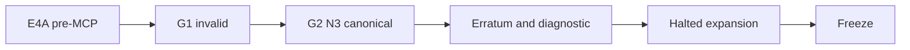

# Project KB Experiments and Results

## 1. Scope and reading rules

Этот документ описывает измеренные результаты экспериментов Project KB, известные ограничения оценивания, остановленное расширение и инженерную интерпретацию, которая поддержала решение о заморозке продукта. Методика эксперимента принадлежит [Benchmark Methodology](BENCHMARK.md); здесь она не повторяется.

Категории утверждений разделяются явно:

- **Факт измерения** — значение или состояние, непосредственно подтверждённое сохранённым артефактом эксперимента;
- **Canonical historical evaluation** — неизменённый результат исторического оценивания закрытой совокупности запусков;
- **Erratum** — обнаруженный позднее дефект оценивания или производного утверждения, который меняет интерпретацию, но не переписывает канонический артефакт;
- **Diagnostic** — ограниченный неканонический расчёт для проверки конкретной гипотезы;
- **Интерпретация** — осторожный вывод в пределах замороженного дизайна;
- **Product decision** — инженерное решение о состоянии продукта, а не измеренный научный результат.

Имена условий задают доступную политику доступа, а не обязательное или исключительное использование названного инструмента. Результаты не устанавливают статистическую значимость и не обобщаются автоматически на другие репозитории, задачи, модели, клиенты или моменты времени.

## 2. Experiment lineage and evidence classes

Линия результатов остаётся последовательной: `E4A` до MCP-транспорта Project KB, недопущенное поколение `G1`, полная initial N3 совокупность `G2`, erratum и mapping-only diagnostic, остановленное расширение r4/r5 и заморозка продукта. Формального N5 и поколения G3 в этой линии нет.

**Примечание о происхождении результата.** Байты initial G2, расписание, raw results, `seal` и canonical evaluation сохранены неизменными. Дефект evaluator был обнаружен позднее при проверке исходного кода и артефактов. Каноническое оценивание осталось историческим; diagnostic получен отдельным статическим отображением идентификаторов и не заменяет canonical artifact.

## 3. E4A pre-MCP results

**Факт измерения.** `E4A` включала 3 задачи × 4 условия = 12 точных ячеек. Все 12 запусков были действительными, каждая точная ячейка имела `N=1`, и canonical correctness составила `10/10` во всех ячейках.

| TASK | NATIVE | PYCHARM | PKB | HYBRID |
| --- | ---: | ---: | ---: | ---: |
| `AUDIT_1V2` | 10/10 | 10/10 | 10/10 | 10/10 |
| `AUDIT_2` | 10/10 | 10/10 | 10/10 | 10/10 |
| `AUDIT_4V2` | 10/10 | 10/10 | 10/10 | 10/10 |

Доступ Project KB в `PKB` и `HYBRID` выполнялся через подготовленный прямой subprocess reader, а не через MCP-транспорт Project KB. Read-only доступ к native source и Git оставался разрешённым.

**Интерпретация.** `E4A` показывает, что проверенные рабочие процессы могли давать полностью корректные ответы при заданных политиках доступа. Однако `N=1` на точную ячейку означает статус `PARTIALLY_REPLICATED`: это не same-cell replication, не чистая причинная оценка Project KB и не доказательство общего превосходства.

## 4. G1 invalid experiment generation

**Факт измерения — invalid experiment generation / admission failure.** Замороженное расписание `G1` содержало 18 плановых ячеек. Structured-output schema была отклонена до содержательного ответа: ограничение `uniqueItems` не поддерживалось валидатором response format, а ошибка имела код `invalid_json_schema`.

В `G1` не возникла научно допустимая измеренная совокупность, не были созданы действительные `seal` и canonical evaluation. Поэтому для `G1` нет performance score: это отказ на границе допуска эксперимента, а не плохой результат MCP.

## 5. G2 initial N3 canonical results

**Факт измерения.** Initial N3 поколения `G2` включала две задачи, условия `PYCHARM`, `PKB_MCP`, `HYBRID_MCP` и три измеряемых повтора на точную пару задача×условие. Состояние закрытия: 18 planned, 18 persisted, 18 scientifically eligible, `complete=true`; canonical evaluation включает все 18 запусков.

| TASK | CONDITION | R1 | R2 | R3 | STATUS |
| --- | --- | ---: | ---: | ---: | --- |
| `AUDIT_1V2` | `PYCHARM` | 10 | 10 | 10 | Canonical historical evaluation |
| `AUDIT_1V2` | `PKB_MCP` | 9 | 9 | 9 | Canonical historical evaluation |
| `AUDIT_1V2` | `HYBRID_MCP` | 9 | 8 | 8 | Canonical historical evaluation |
| `AUDIT_4V2` | `PYCHARM` | 9 | 8 | 5 | Canonical historical evaluation |
| `AUDIT_4V2` | `PKB_MCP` | 9 | 9 | 8 | Canonical historical evaluation |
| `AUDIT_4V2` | `HYBRID_MCP` | 8 | 8 | 8 | Canonical historical evaluation |

**Canonical historical evaluation.** Эти значения являются точным выходом замороженного evaluator. Они не называются исправленными и не заменяются поздней диагностикой. Допустимость запуска и correctness score — разные свойства: все 18 запусков допустимы, хотя не все получили максимальный балл.

## 6. Evaluator erratum and mapping-only diagnostic

### Erratum evaluator

**Erratum.** Replicated harness передавал `PKB_MCP` и `HYBRID_MCP` непосредственно в legacy evaluator. Его evidence allowlist распознавал только прежние `PKB` и `HYBRID`, поэтому все 12 candidate evaluations попадали в неверную ветвь проверки evidence discipline.

Чистое отображение `PKB_MCP → PKB` и `HYBRID_MCP → HYBRID` восстанавливает один балл в 11 из 12 запусков. Исключение — `AUDIT_4V2 / HYBRID_MCP / r2`: в сохранённом ответе две записи `source_evidence` имеют `relative_path: "."`, а legacy evaluator независимо запрещает компонент пути `"."`. Поэтому для этого запуска evidence-discipline point не восстанавливается.

Следствие ограничено: часть видимого candidate correctness penalty вызвана evaluator, поэтому наивное сравнение нельзя считать чистым evidence качества retrieval или регрессии. При этом erratum не объясняет каждый остаточный дефект и не изменяет canonical artifact.

### Mapping-only diagnostic

> **Diagnostic — noncanonical. Mapping-only diagnostic. Not a canonical reevaluation.**

| TASK | CONDITION | R1 | R2 | R3 | STATUS |
| --- | --- | ---: | ---: | ---: | --- |
| `AUDIT_1V2` | `PKB_MCP` | 10 | 10 | 10 | Diagnostic; noncanonical |
| `AUDIT_1V2` | `HYBRID_MCP` | 10 | 9 | 9 | Diagnostic; noncanonical |
| `AUDIT_4V2` | `PKB_MCP` | 10 | 10 | 9 | Diagnostic; noncanonical |
| `AUDIT_4V2` | `HYBRID_MCP` | 9 | 8 | 9 | Diagnostic; noncanonical |

В ранее сохранённом производном аналитическом утверждении последняя строка была представлена как `9 / 9 / 9`. Это историческая derived-diagnostic error: чистое отображение condition ID при неизменных остальных правилах даёт `9 / 8 / 9`. Ошибка относится к производной диагностике, а не к canonical evaluation.

Два остаточных отклонения `AUDIT_1V2 / HYBRID_MCP` связаны с сериализацией default values в ответе. Для `AUDIT_4V2` остаточные не-evidence ошибки встречались у разных providers и согласуются с трудностью синтеза сложного ответа; это не доказывает отсутствие или наличие Project KB-specific retrieval regression.

## 7. Efficiency observations

**Факт измерения.** Таблица использует медианы initial G2 N3. `Δ` рассчитана относительно `PYCHARM` внутри той же задачи; elapsed-медианы рассчитаны из исходной точности, опубликованы с тремя знаками, а проценты рассчитаны из неокруглённых медиан и округлены до двух знаков.

| TASK | CONDITION | MEDIAN ELAPSED, S | Δ ELAPSED VS PYCHARM | MEDIAN INPUT TOKENS | Δ TOKENS VS PYCHARM |
| --- | --- | ---: | ---: | ---: | ---: |
| `AUDIT_1V2` | `PYCHARM` | 129.588 | 0.00% | 168 144 | 0.00% |
| `AUDIT_1V2` | `PKB_MCP` | 91.422 | -29.45% | 96 964 | -42.33% |
| `AUDIT_1V2` | `HYBRID_MCP` | 95.877 | -26.01% | 110 538 | -34.26% |
| `AUDIT_4V2` | `PYCHARM` | 478.249 | 0.00% | 406 542 | 0.00% |
| `AUDIT_4V2` | `PKB_MCP` | 453.197 | -5.24% | 990 035 | +143.53% |
| `AUDIT_4V2` | `HYBRID_MCP` | 503.572 | +5.29% | 963 363 | +136.97% |

**Интерпретация — `AUDIT_1V2`.** Candidate policies дали сильный описательный сигнал: меньшие elapsed и input-token medians. Но только 2 из 6 candidate runs фактически использовали Project KB MCP; native source и Git оставались доступны, а MCP не был обязательным. Поэтому результат не является чистым причинным доказательством пользы Project KB или MCP.

**Интерпретация — `AUDIT_4V2`.** Материального elapsed-преимущества нет: `PKB_MCP` быстрее примерно на 5%, а `HYBRID_MCP` немного медленнее `PYCHARM`. Одновременно обе candidate conditions использовали примерно в 2.4 раза больше input tokens. Этот отрицательный результат нельзя усреднять с `AUDIT_1V2` в одного глобального победителя.

## 8. Expansion stop, formal N5 and G3 boundaries

**Факт измерения.** Нумерация продолжает initial G2: expansion schedule соответствует Cells 19–30.

| CELL | TASK | CONDITION | REPLICATE | EXECUTION STATE |
| ---: | --- | --- | --- | --- |
| 19 | `AUDIT_1V2` | `PYCHARM` | r4 | `SCIENTIFICALLY_ELIGIBLE` |
| 20 | `AUDIT_1V2` | `PKB_MCP` | r4 | `SCIENTIFICALLY_ELIGIBLE` |
| 21 | `AUDIT_1V2` | `HYBRID_MCP` | r4 | `SCIENTIFICALLY_ELIGIBLE` |
| 22 | `AUDIT_4V2` | `HYBRID_MCP` | r4 | `SCIENTIFICALLY_ELIGIBLE` |
| 23 | `AUDIT_4V2` | `PKB_MCP` | r4 | `UNCLASSIFIED_INVALID`: `CODEX_TIMEOUT`; `NONZERO_OR_MISSING_CODEX_EXIT` |
| 24 | `AUDIT_4V2` | `PYCHARM` | r4 | Not run |
| 25 | `AUDIT_1V2` | `PKB_MCP` | r5 | Not run |
| 26 | `AUDIT_1V2` | `HYBRID_MCP` | r5 | Not run |
| 27 | `AUDIT_1V2` | `PYCHARM` | r5 | Not run |
| 28 | `AUDIT_4V2` | `PYCHARM` | r5 | Not run |
| 29 | `AUDIT_4V2` | `HYBRID_MCP` | r5 | Not run |
| 30 | `AUDIT_4V2` | `PKB_MCP` | r5 | Not run |

Cells 19–22 — сохранённые допустимые частичные доказательства, но не завершённая N5-совокупность. Cell 23 была выполнена один раз и израсходовала своё замороженное пространство имён; retry или replacement не разрешались. Cells 24–30 не выполнялись. Expansion `seal` и evaluation не существуют, а заранее объявленный знаменатель нельзя уменьшить post hoc.

> **Formal N5 does not exist.** Неполная совокупность, consumed invalid Cell 23, отсутствующие поздние ячейки и отсутствие `seal`/evaluation исключают реконструкцию N5 из initial N3 и частичных r4/r5.

> **G3 was not created.** Отсутствующий результат нельзя выводить или восстанавливать задним числом.

## 9. Interpretation and freeze decision

### Measured and observed facts

- `E4A` показала жизнеспособный структурный доступ до MCP Project KB, но exact cells имели `N=1`;
- `G1` не прошла admission и не дала performance result;
- initial N3 `G2` была полностью закрыта и показала как положительные, так и отрицательные сигналы политик доступа;
- evaluator erratum ослабляет наивное сравнение canonical correctness, не устраняя все остаточные ошибки;
- `AUDIT_1V2` показала сильное описательное снижение elapsed и tokens при ограниченной фактической Project KB MCP uptake;
- `AUDIT_4V2` показала серьёзный token-cost harm и мало или совсем не показала elapsed benefit;
- expansion остановилась до formal N5.

### Product decision

**Product decision.** Freeze выбран как инженерное и продуктовое решение. Архитектура и safety contract были достаточно зрелыми для цели portfolio/reference implementation; уже полученные результаты отвергли упрощённый тезис «Project KB всегда выигрывает»; дальнейшее расширение benchmark и ремонт evaluator имели уменьшающуюся ценность для решения; продолжение R&D не требовалось для целевого использования проекта.

Freeze не является научным доказательством превосходства или неполноценности, не доказывает production readiness и не превращает ограниченные результаты в универсальный вывод.

## 10. Confidence and limitations

| CLAIM CLASS | CONFIDENCE | WHY |
| --- | --- | --- |
| Текущая архитектура продукта | HIGH | Проверяется по текущему коду и принадлежит отдельной архитектурной документации |
| Canonical E4A measured values | HIGH как исторический факт | Полная evaluation для 12 действительных ячеек; same-cell `N=1` ограничивает повторяемость |
| Canonical G2 initial N3 evaluation | HIGH как исторический факт | Полные schedule, raw chains, `seal` и evaluation для 18 допустимых запусков |
| Наличие evaluator erratum | HIGH | Caller передавал новые IDs, а legacy allowlist распознавал только прежние IDs |
| Pure mapping-only diagnostic | HIGH в узкой диагностической границе | Статическое применение только condition-ID mapping; результат неканонический |
| Descriptive elapsed/token medians | HIGH для измеренной совокупности | Пересчитаны из 18 raw results; это описательная статистика `N=3` |
| Причинная атрибуция Project KB/MCP | LOW | Условия задавали доступность, native/Git оставались разрешены, фактическое MCP-использование было неполным |
| Обобщение за пределы замороженных задач, source и модели | UNSUPPORTED | Другие репозитории, задачи, модели и клиенты не измерялись |
| Halted expansion; отсутствие N5 и G3 | HIGH | Расписание, пять существующих raw results и отсутствие `seal`/evaluation задают точную границу |

Статистические доверительные интервалы не вычислялись. Малые совокупности, изменившийся между поколениями транспорт и неизолированное использование разрешённых providers ограничивают сравнение поколений и причинную интерпретацию.

## 11. Related documentation

- [Benchmark Methodology](BENCHMARK.md) — дизайн эксперимента, единица измерения, допустимость, `seal` и границы воспроизводимости;
- [Development History](DEVELOPMENT_HISTORY.md) — инженерная хронология E4A, G1, G2, остановленного expansion и freeze;
- [Architecture](ARCHITECTURE.md) — текущая архитектура и владельцы компонентов;
- [Data Safety Policy](DATA_SAFETY_POLICY.md) — нормативные границы записи, identity и fail-closed поведения;
- [README](../README.md) — краткое позиционирование и публичный интерфейс проекта.
